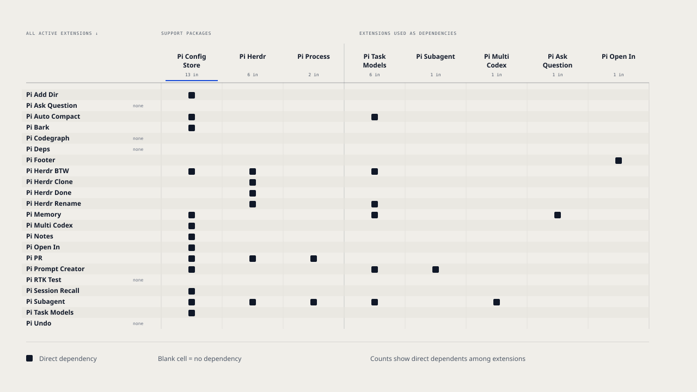

# Henry Pi Harness

[](https://github.com/HenryQW/pi-harness/blob/main/LICENSE)
[](https://www.npmjs.com/~henryqw)

Highly opinionated Pi harness.

See [the doc](https://pi.henry.wang).

## Install

```sh
curl -fsSL https://pi.henry.wang/install.sh | sh
```

The installer shows installed Pi and Herdr versions. It asks before updating either tool.

Use `--update` to approve available updates without a prompt:

```sh
curl -fsSL https://pi.henry.wang/install.sh | sh -s -- --update
```

## Extension dependencies

Each row is an active extension; a filled square marks a **direct** dependency on the package named above its column. Empty rows have no internal dependencies. Column counts show how many extensions depend directly on that package. The table below is a text version of the diagram.



Deprecated extensions and `@deprecated/` are excluded.
