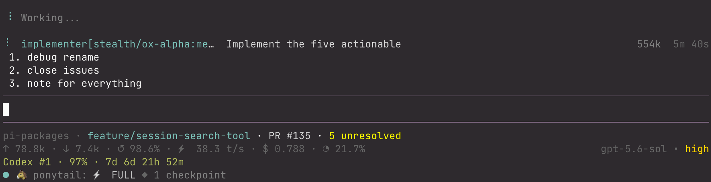
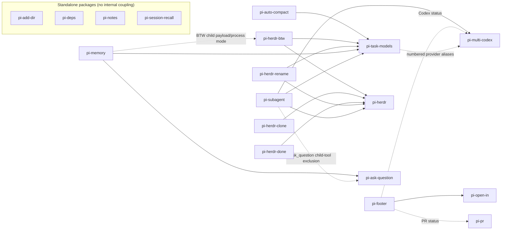

# HenryQW Pi packages

These are the Pi extensions I use daily. They are highly opinionated. I publish them as-is.

I offer no support or backward compatibility. Breaking changes may be introduced at any time. Packages use the `@henryqw` scope.



## Packages

| Package | Purpose |
| --- | --- |
| [`@henryqw/pi-add-dir`](./packages/pi-add-dir) | Add external directories with context, skills, and file search. |
| [`@henryqw/pi-ask-question`](./packages/pi-ask-question) | Ask user one interactive multiple-choice or free-text question. |
| [`@henryqw/pi-auto-compact`](./packages/pi-auto-compact) | Compact context at the set threshold and resume current task. |
| [`@henryqw/pi-deps`](./packages/pi-deps) | Prepare locked Node and uv dependencies for opted-in Git worktrees. |
| [`@henryqw/pi-footer`](./packages/pi-footer) | Henry's opinionated Pi footer style for concise checkout and usage details. |
| [`@henryqw/pi-herdr`](./packages/pi-herdr) | Run Herdr CLI commands through a shared thin client. |
| [`@henryqw/pi-herdr-btw`](./packages/pi-herdr-btw) | Open and merge Pi side threads in Herdr panes. |
| [`@henryqw/pi-herdr-clone`](./packages/pi-herdr-clone) | Clone the current Pi conversation path into a new Herdr tab. |
| [`@henryqw/pi-herdr-done`](./packages/pi-herdr-done) | Close and remove current Herdr worktree. |
| [`@henryqw/pi-herdr-rename`](./packages/pi-herdr-rename) | Generate short chat titles and rename current Herdr location. |
| [`@henryqw/pi-memory`](./packages/pi-memory) | Maintain size-capped agent memory and user-profile stores across sessions. |
| [`@henryqw/pi-multi-codex`](./packages/pi-multi-codex) | Use multiple ChatGPT Codex OAuth accounts in Pi. |
| [`@henryqw/pi-notes`](./packages/pi-notes) | Keep persistent per-worktree notes visible in a Pi widget. |
| [`@henryqw/pi-open-in`](./packages/pi-open-in) | Open current working directory with configurable command. |
| [`@henryqw/pi-pr`](./packages/pi-pr) | Show current-branch PR lifecycle, CI, mergeability, and review state in Pi footer. |
| [`@henryqw/pi-session-recall`](./packages/pi-session-recall) | Search past Pi sessions with local FTS5 and zero LLM calls. |
| [`@henryqw/pi-subagent`](./packages/pi-subagent) | Delegate bounded single, parallel, chained, and package-owned Git Flow work to isolated roles. |
| [`@henryqw/pi-task-models`](./packages/pi-task-models) | Shared `fast`/`balanced`/`frontier` model profiles for HenryQW extensions. |

## Internal package relationships

Each of the 18 `packages/*` workspaces appears once below. Solid arrows (`-->`) show internal `@henryqw` npm runtime dependencies declared in `packages/*/package.json`.

Dashed arrows (`-.->`) show direct runtime protocols or couplings without an internal npm dependency. They are evidenced by package behavior or documentation. Arrows point from the consumer or recognizer to the provider or producer.



## Deprecated

Retired extensions and their replacements are recorded under [`deprecated/`](./deprecated).

## Remove

```bash
pi remove npm:@henryqw/<package>
```

Replace `<package>` with the package's unscoped name, for example `pi-subagent`.

Before removing `@henryqw/pi-deps`, disable each opted-in repository with `/deps`. Its copied hook is self-contained.

After removing `@henryqw/pi-session-recall`, delete its derived index to reclaim storage:

```bash
rm -rf ~/.pi/agent/config/pi-session-recall/
```

## Development

Requires Node.js `>=22.19.0`.

```bash
npm ci
npm test
npm run typecheck
npm run pack:check
```

Run live Pi integration tests only when authenticated model access is available:

```bash
npm run test:live
```

Live tests use real model requests. They can incur provider cost. They set a temporary small context window so compaction completes quickly.

Manual Pi TUI check for `@henryqw/pi-ask-question`:

```bash
npm run test:manual --workspace @henryqw/pi-ask-question
```

`@henryqw/pi-auto-compact` live test needs real Pi and authenticated model access:

```bash
npm run test:live --workspace @henryqw/pi-auto-compact
PI_AUTO_COMPACT_AUTH_FILE=/path/to/auth.json npm run test:live --workspace @henryqw/pi-auto-compact
```

Set `PI_AUTO_COMPACT_AUTH_FILE` only when auth is not at `~/.pi/agent/auth.json`.

## Release

See [`docs/releasing.md`](./docs/releasing.md). Each package publishes independently. Package names use the `@henryqw` scope.
