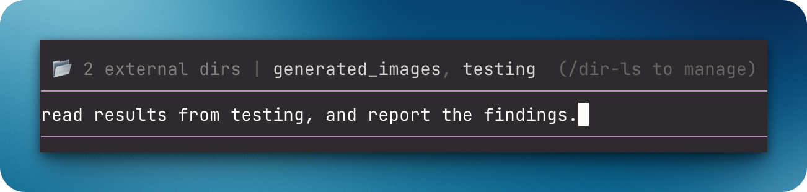

# `@henryqw/pi-add-dir`

Add external directories to the current Pi session. Pi can use their context files and skills, and search their files.



## Why

- **Created for**: Use context and skills outside the current working directory.
- **Advantage**: Use external trees without copying them into the repository.

## Install

```bash
pi install npm:@henryqw/pi-add-dir
```

## Use

| Surface | Type | Purpose |
| --- | --- | --- |
| `/dir-add` | command | Add directory; no path opens input. Supports `~`. |
| `/dir-ls` | command | List directories; select one to remove. |
| `/dir-reload` | command | Reload external directory resources. |
| `add_directory` | tool | Add a directory. |
| `search_external_files` | tool | Glob-search added directories. |

Added directories give Pi these resources:

- Root `AGENTS.md`, `CLAUDE.md`, `.pi/AGENTS.md`, and `.pi/CLAUDE.md` files. Pi injects them into later prompts.
- Skills that Pi loads from `.pi/skills`, `.agents/skills`, and `.claude/skills`.
- Files in the editor's `@` autocomplete, with absolute paths.

`/dir-add` reloads when it finds skills. `add_directory` reports when a reload is needed.

Search supports basename and relative-path globs. It skips `.git` and `node_modules`. It uses Node filesystem traversal and returns at most 1,000 results per call.

## State

Pi session entry `add-dir:state` stores added directories. It is package-managed; do not edit it. Tree navigation restores the active branch's directories and reloads resources when that set changes.
