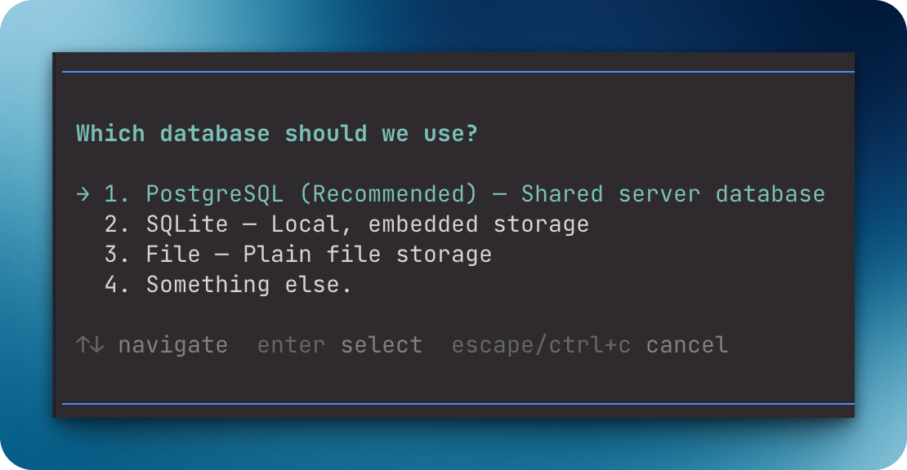

# `@henryqw/pi-ask-question`

Ask the user one interactive question with up to three choices, or a custom answer.



## Why

- **Created for**: Ask the user one interactive question with up to three choices during a Pi session.
- **Advantage**: Show a keyboard-selectable prompt and return one explicit answer instead of parsing free-form chat.

## Install

```bash
pi install npm:@henryqw/pi-ask-question
```

## Use

Use `ask_question` to pause for one interactive answer.

```json
{
  "question": "Which database should we use?",
  "options": [
    { "label": "PostgreSQL", "description": "Shared server database" },
    { "label": "SQLite", "description": "Local, embedded storage" },
    { "label": "File", "description": "Plain file storage" }
  ]
}
```

- Supply one to three options in preference order.
- The UI marks the first option `(Recommended)`.
- The UI adds `Something else.`, which opens a text input for a custom answer.

The tool returns an error for empty questions, blank or duplicate labels, empty lists, more than three options, and non-interactive sessions. Aborting the tool closes the pending question.

Extensions can reuse the validated interaction with `askQuestion(params, ctx, signal)`. This package export returns the tool's answer details without registering another UI flow.
