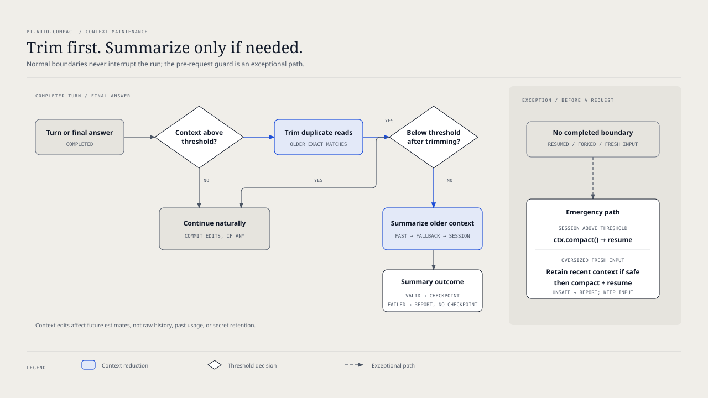

# `@henryqw/pi-auto-compact`

Trim repeated reads before compacting long Pi sessions. Completed tool turns continue naturally; compaction after a final answer does not start another turn. Your threshold leaves context headroom.

## Install

```bash
pi install npm:@henryqw/pi-task-models
pi install npm:@henryqw/pi-auto-compact
```

Install `@henryqw/pi-task-models` first. Run `/task-models` and configure the `fast` profile. Open `/task-models` again to verify that `fast` no longer says `not configured`.

Disable Pi's built-in auto-compaction in `~/.pi/agent/settings.json`:

```json
{
  "compaction": {
    "enabled": false
  }
}
```

Restart Pi after install or settings changes. Trusted `.pi/settings.json` files must not set `compaction.enabled` back to `true`.

## Works with

| Package | Relationship | Purpose |
| --- | --- | --- |
| [`@henryqw/pi-task-models`](https://pi.henry.wang/extensions/pi-task-models) | Required | Provides shared compaction routes. |

Its `~/.pi/agent/config/pi-task-models/config.json` file is shared and owned by Task Models. The local `pi-auto-compact/autoCompact` declaration defaults to `fast`. A task entry is an explicit user override.

## Use

Run `/auto-compact` and enter a threshold. Pi confirms it as `Auto-compact threshold set to <value>%.` Trimming has no separate switch; disable or remove this extension to opt out.

## Flow



- The extension refuses to activate unless effective `compaction.enabled` is `false`.
- At completed `turn_end` and `agent_before_settle` boundaries, it first replaces older successful text-only `read` results that exactly match a later full read in the protected recent context. Tool name, arguments, and text must match. Failed, changed, image-bearing, or already edited results stay intact. No summary request runs if trimming brings context below the threshold.
- If trimming is insufficient, it summarizes older effective context through the `fast` profile primary, then fallback, then the current session model. Pi commits the edit and compaction entries without interrupting a normal tool turn or restarting a final answer. A failed summary does not become a checkpoint.
- Resumed/forked sessions and oversized fresh input may need emergency `ctx.compact()` before a completed boundary exists. That exceptional path interrupts and resumes the task. If a fresh input cannot be safely reduced, the extension reports the limit rather than discarding it silently.
- Context edits preserve raw session history, export, UI display, and historical usage. They reduce estimated future context only; earlier tokens are not refunded. An edit to an older prefix may also reduce provider cache reuse. This is not secret erasure.

Malformed shared task-model config is reported and left unchanged. Compaction then uses the current session model.

## Config

Package-owned: `~/.pi/agent/config/pi-auto-compact/config.json`

| Name | Description | Values | Default |
| --- | --- | --- | --- |
| `autoCompactThreshold` | Sets the context-use percentage that triggers compaction. | Number from 25 inclusive to below 100. | `70` |

Unknown fields are ignored. Legacy model fields are obsolete. `/auto-compact` writes this file.

A missing file uses 70%. Reads do not create it. A malformed or invalid file fails visibly at session start, falls back to 70%, and stays unchanged.

Only `/auto-compact` writes this file. Its write is atomic.
