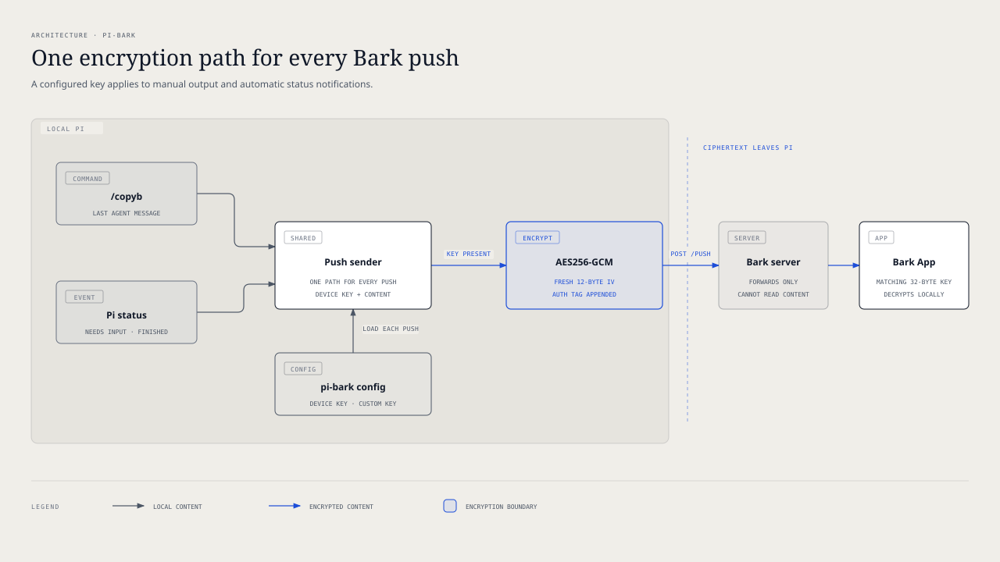

# `@henryqw/pi-bark`

Get [Bark](https://bark.day.app) notifications when Pi finishes or needs your input. Use `/copyb` to send Pi's latest response to your device.

## Install

```bash
pi install npm:@henryqw/pi-bark
```

### Setup

1. Open the Bark App and copy its test URL.
2. Take the Device Key from the URL.
3. Run `/set-bark` in Pi.

For Bark's public server:

```text
/set-bark your-device-key
```

For a self-hosted Bark server:

```text
/set-bark your-device-key https://bark.example.com
```

A test URL such as `https://api.day.app/your-device-key/Test` contains the Device Key after the host. Do not include sample push content such as `/Test`.

Treat the Device Key as a secret. Anyone with it can send push notifications to your device.

## Use

Run `/copyb` with no arguments.

The command copies the last agent message to your clipboard. It then sends a Bark V2 push request to `<serverUrl>/push`.

Without push encryption, the JSON request uses Bark's standard parameter names:

```json
{
  "device_key": "your-device-key",
  "body": "the last agent message"
}
```

The `body` value is the same text that Pi's `/copy` command selects. Markdown, code blocks, spacing, and line breaks stay unchanged.

| Surface | Type | Purpose |
| --- | --- | --- |
| `/copyb` | command | Copy the last agent message and send a Bark push notification. |
| `/set-bark <device-key> [server-url]` | command | Save the Device Key and Bark server URL. |
| `/bark-notifications on\|off\|inherit` | command | Override automatic status notifications for the current CWD. |
| `/bark-notifications default on\|off` | command | Set the default for CWDs without an override. |
| `pi-bark-key [--force \| --disable]` | executable | Generate, replace, or disable the Custom Encryption Key. |

### Automatic status notifications

After setup, pi-bark sends two status-only notifications:

- **Pi needs input** when Pi opens a blocking user prompt, including `ask_question`.
- **Pi finished** after the agent has fully settled and will not continue automatically.

Each notification includes Pi's current session name. Herdr shows the same name when `pi-herdr-rename` is active. pi-bark does not call Herdr or read Herdr state.

An unset session name appears as `Unnamed`. Status notifications do not include prompts or agent output. No notification is sent when a prompt closes.

Automatic notifications are enabled by default. Disable them only in the current CWD:

```text
/bark-notifications off
```

Use `on` to enable the current CWD explicitly. Use `inherit` to remove its override. The CWD then follows the global default.

Change that default for all CWDs without an override:

```text
/bark-notifications default off
```

These settings do not affect `/copyb`. CWD overrides live in pi-bark's global config, not in project files.

## Flow



## Config

Package-owned: `~/.pi/agent/config/pi-bark/config.json`

| Name | Description | Values | Default |
| --- | --- | --- | --- |
| `serverUrl` | Base URL of the Bark server that accepts push requests. | HTTP or HTTPS URL with an optional path and no query or fragment. | `"https://api.day.app"` |
| `deviceKey` | Identifies the Bark App installation that receives the push notification. | Non-empty string or `null`. | `null` |
| `encryption` | Custom Encryption Key and matching Bark encryption settings. | AES256-GCM settings object or `null`. | `null` |
| `statusNotifications` | Controls automatic status notifications by CWD. | Global boolean default and absolute-CWD boolean overrides. | Enabled with no overrides. |

### Push encryption

Push encryption is optional. It prevents the Bark server and Apple Push Notification service from reading push content.

Once configured, pi-bark encrypts every push it sends. This includes `/copyb` and both automatic status notifications.

#### Set up encryption

1. Configure your Bark Device Key with `/set-bark`.
2. Generate and save a Custom Encryption Key:

   ```bash
   npx --yes --package=@henryqw/pi-bark -- pi-bark-key
   ```

   `npx` temporarily downloads the package and runs its `pi-bark-key` executable. The command saves the key to pi-bark's config and prints it once.

3. Open **Bark App → Push Encryption**.
4. Enter these settings:

   | Setting | Value |
   | --- | --- |
   | Algorithm | `AES256` |
   | Mode | `GCM` |
   | Padding | `noPadding` |
   | Key | The generated 32-character key |

   The generated ASCII key is 32 characters and 32 bytes.

5. If Bark requires an IV, enter any 12 ASCII characters, such as `000000000000`.
6. Save the Bark settings.
7. Run `/copyb` in Pi. Bark should show the exact last agent message instead of `Decryption Failed`.

The saved IV is only a placeholder for older Bark versions. pi-bark creates a fresh 12-byte IV for each push and sends it with the ciphertext. Bark uses that per-push IV instead of the saved value.

Do not paste the command output into shared logs. The Custom Encryption Key can decrypt your push content.

The GCM authentication tag is appended to the ciphertext before Base64 encoding, as Bark requires.

#### Replace or disable the key

The command refuses to overwrite an existing key. Replace it only when you also update the Bark App:

```bash
npx --yes --package=@henryqw/pi-bark -- pi-bark-key --force
```

Disable push encryption in pi-bark with:

```bash
npx --yes --package=@henryqw/pi-bark -- pi-bark-key --disable
```

Disable Push Encryption in the Bark App too. Otherwise its settings no longer match pi-bark.

The config file has this shape:

```json
{
  "serverUrl": "https://api.day.app",
  "deviceKey": "your-device-key",
  "encryption": {
    "algorithm": "AES256",
    "mode": "GCM",
    "padding": "noPadding",
    "key": "your-32-character-custom-key"
  },
  "statusNotifications": {
    "defaultEnabled": true,
    "cwdOverrides": {
      "/srv/quiet-project": false
    }
  }
}
```

Set `encryption` to `null` when push encryption is disabled.

- A missing config stays missing until a command or the key script writes it.
- `/set-bark` preserves Push Encryption and status notification settings.
- The server URL must use HTTP or HTTPS. It cannot contain a query or fragment delimiter.
- Config writes are private and atomic.
- Pi commands never print the Device Key, server URL, or Custom Encryption Key.

## Limits and recovery

Bark and Apple Push Notification service limit notification payload sizes. This extension does not truncate push content. Bark returns an error when a message is too large.

`/copyb` waits up to 15 seconds for the Bark server. If the push request fails after the clipboard copy, your clipboard still contains the message.

Invalid config files cause a visible error and remain unchanged. Fix or move the malformed file, then retry the command.

See Bark's [Push Encryption documentation](https://github.com/Finb/Bark/blob/master/docs/en-us/encryption.md) for the encryption model.
