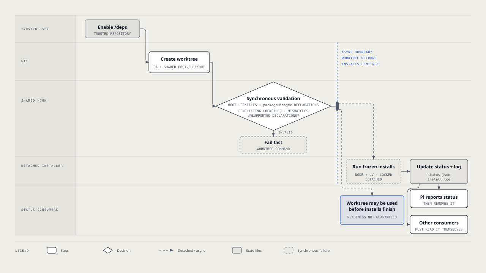

# `@henryqw/pi-deps`

Start locked Node and uv dependency installs whenever Git creates a worktree for an opted-in repository.

## Why

- **Created for**: Developers who create worktrees through several tools.
- **Advantage**: One Git hook prepares every new checkout without adding work to each Pi startup.

## Install

```bash
pi install npm:@henryqw/pi-deps
```

Node 22.19 or newer, Git, and each selected package manager must be available on `PATH` used by Git.

## Use

Run `/deps` in a trusted repository to enable preparation. Create a worktree, then open Pi there.

Pi shows install progress and reports the result. Run `/deps` again when you want to disable future preparation.

### Enable, disable, and update

- Run `/deps` once from any worktree to enable preparation through the repository's shared `post-checkout` hook.
- Run `/deps` again to disable it.
- Hooks without this package's marker are never overwritten or removed.
- After updating the package, run `/deps` twice in each opted-in repository. This replaces the copied hook with the current version.
- A configured `core.hooksPath` replaces the shared hooks directory. `/deps` refuses instead of installing where Git would ignore or share the hook.

### What it prepares

- Only Git-root lockfiles are inspected.
- npm, pnpm, Yarn, and Bun use frozen installs. uv uses `uv sync --locked`.
- Node and uv both run when both lockfile types exist.
- Root npm and uv workspaces remain package-manager concerns. Nested independent projects are not scanned.

### Background install and status



- Worktree creation returns immediately.
- The hook validates lockfiles synchronously. Conflicting Node lockfiles, `packageManager` mismatches, and unsupported declarations still fail the worktree command fast.
- A detached installer runs frozen installs in the background.
- Its result is stored in `<worktree gitdir>/pi-deps/status.json`. Command output is in the adjacent `install.log`.
- The status file is removed once a Pi session reports it.
- A Pi session in the worktree shows an editor widget while installing. It auto-dismisses success after five seconds and keeps failures visible, including missing executables.
- Other tools that create worktrees get the same background install. They must consume the status file themselves.

### Limits and safety

- Already-present `node_modules`, `.pnp.cjs`, or `.venv` are skipped.
- Worktrees created with `git worktree add --no-checkout` never run `post-checkout`, so they are not prepared.
- Installs finish after creation returns. A consumer may use a worktree before dependencies are ready.
- Dependency installation may execute repository-controlled build and install scripts. Enable only repositories you trust.

## Supported managers

Only current major versions are supported. Older majors are not handled and fall back to the lockfile default below.

| Manager | Command | Lockfile |
| --- | --- | --- |
| npm | `npm ci` | `package-lock.json`, `npm-shrinkwrap.json` |
| pnpm | `pnpm install --frozen-lockfile` | `pnpm-lock.yaml` |
| Yarn | `yarn install --immutable` | `yarn.lock` (Yarn Classic 1.x is not supported) |
| Bun | `bun install --frozen-lockfile` | `bun.lock`, `bun.lockb` |
| uv | `uv sync --locked` | `uv.lock` |
