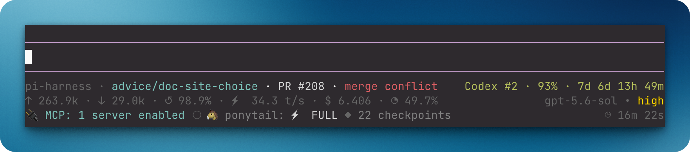

# `@henryqw/pi-footer`

Keep checkout identity, model usage, elapsed agent work, and extension status visible while you work in Pi. See repository, pull request, model, cost, and status details without separate commands.



## Install

```bash
pi install npm:@henryqw/pi-footer
```

## Works with

| Package | Relationship | Purpose |
| --- | --- | --- |
| [`@henryqw/pi-codegraph`](https://pi.henry.wang/extensions/pi-codegraph) | Improves | Shows CodeGraph index and direct tool activity when loaded. |
| [`@henryqw/pi-multi-codex`](https://pi.henry.wang/extensions/pi-multi-codex) | Improves | Adds active Codex subscription quota and reset status. |
| [`@henryqw/pi-open-in`](https://pi.henry.wang/extensions/pi-open-in) | Improves | Adds `/open` and `/set-open-in` commands for editor configuration. |
| [`@henryqw/pi-pr`](https://pi.henry.wang/extensions/pi-pr) | Improves | Adds current-branch pull-request status. |

## Use

After installing, start a Pi TUI session to see checkout, usage, model, thinking, and extension statuses.

```text
pi-harness · clear-field-f8d2 [+2 ~3 ?1 ↑2] · PR #123 · approved    Codex #1 · 50% · 7d 1d 1h 22m
↑ 12.4k · ↓ 2.1k · ↺ 84.3% · ⚡ 87.4 t/s · $ 0.127 · ◔ 36.8%    gpt-5.6-luna • high
✓ CG · ●  🐴 ponytail: ⚡ FULL                                           ◷ 12m 34s
```

- The first line shows the repository, branch, Git state, and `pi-pr` pull request status. Linked-worktree branches drop the generated `worktree/` prefix.
- The second line shows cumulative input tokens, output tokens, latest cache-hit rate, and tokens per second for the most recent assistant response. It also shows estimated cost and context usage. Totals include reported tool usage and finished `pi-subagent` background workflows. The active model and thinking level are right-aligned.
- The third line shows a compact CodeGraph badge first when loaded: `✓ CG` indexed, `● CG` in use, `◐ CG` checking or indexing, `○ CG` missing, `! CG` setup problem, or `? CG` unknown state. Its icon uses the active theme's state color; `CG` remains plain so the badge is readable without color. When pi-codegraph is not loaded, no badge appears. A middle dot separates statuses from different extensions; cumulative agent-work time stays on the right, beneath the active model.

Git badges appear only when action is needed:

| Badge | Meaning |
| --- | --- |
| `+2` | Two staged paths |
| `~3` | Three unstaged tracked paths |
| `?N` | `N` untracked porcelain status entries |
| `!1` | One unresolved path |
| `↑2` | Two commits ahead of the upstream branch |
| `↓1` | One commit behind the upstream branch |

`?N` counts porcelain status entries. In `--untracked-files=normal` mode, Git may collapse a whole untracked directory to one entry.

Active operations appear first, such as `REBASE 3/7`, `MERGING`, or `CHERRY-PICKING`. Detached HEAD uses the short commit form `@a1b2c3d`.

The extension reads local Git data with `git status --porcelain=v2 --branch --untracked-files=normal`. It refreshes after each agent run and branch change. It does not make an LLM call or fetch a remote. Ahead and behind counts use the last fetched upstream state.

Unavailable values render as `—` without a misleading percent sign.

`off` uses the same dim grey as the model name. Active levels use an ANSI-256 gradient: green `minimal`, yellow-green `low`, lime `medium`, yellow `high`, orange `xhigh`, and red `max`.

`ultra` renders as a rainbow when the active Pi runtime supplies that thinking level. Unsupported levels never appear.

Non-empty statuses from `@henryqw` extensions, currently Codex quota, occupy the right side of the first line.

Statuses from other extensions, including Ponytail and `pi-rewind`, share the left side. They are sorted by key; colors, links, glyphs, and interior spacing are preserved. Leading and trailing whitespace is trimmed, line breaks become spaces, and long statuses may be clipped to fit the footer. Scripted `mcpScript` calls are not visible as individual tool calls, so they do not trigger the `● CG` badge.

## Limits and recovery

When the configured executable is `code` and Pi reports hyperlink support, the accent-colored checkout name links to the current path. The link opens a new window for `code -n` or `code --new-window`. A missing config silently uses `code`. Other executables and terminals with hyperlinks disabled render plain text.

Use Pi fullscreen TUI so Pi handles the custom URI:

```json
{
  "tuiMode": "fullscreen"
}
```

Set this through `/settings`, or launch with `--tui-mode fullscreen`. Then use normal primary click. Regular TUI delegates OSC 8 activation to the terminal.

Ghostty uses `Cmd+click` but may not open custom URI schemes.
