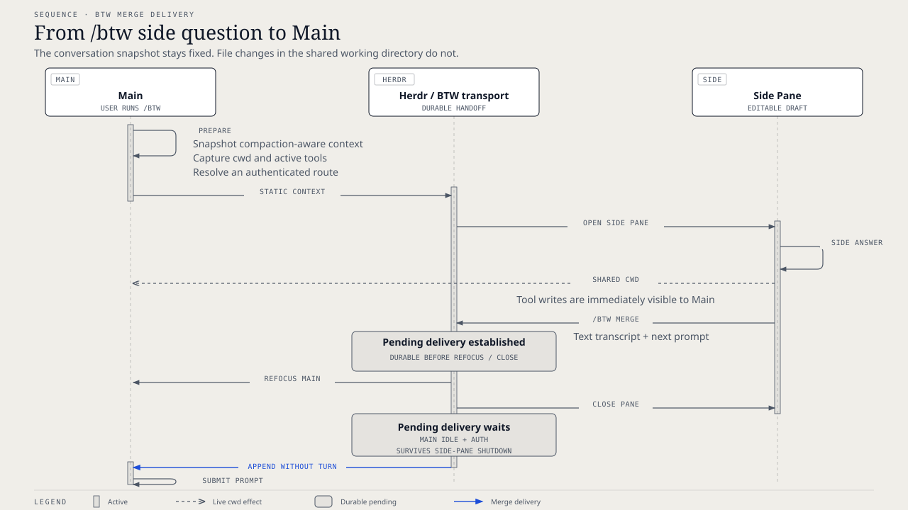

# `@henryqw/pi-herdr-btw`

Ask a focused side question in Herdr, then return its transcript and next instruction to Main.

## Why

- **Created for**: Pi users who need a short detour without changing Main's conversation path.
- **Advantage**: `/btw merge` returns the useful text and next prompt without manual copying.
- **Inspired by**: [Claude Code](https://github.com/anthropics/claude-code) and its `/btw` side-question mode. This package adds transcript merge back into Main.

## Install

```bash
pi install npm:@henryqw/pi-task-models
pi install npm:@henryqw/pi-herdr-btw
```

Requires Herdr 0.7.4+ and a Herdr-managed pane. Run `/task-models` and configure the `fast` profile before opening a side thread.

## With

| Package | Why |
| --- | --- |
| [`@henryqw/pi-memory`](https://pi.henry.wang/extensions/pi-memory) | Improves. Marks side-thread children, suppressing parent-only memory injection and dream advice. |
| [`@henryqw/pi-task-models`](https://pi.henry.wang/extensions/pi-task-models) | Required. Provides shared model profiles for side-thread routes. |

## Use

Run `/btw Why is this test failing?` and submit the draft in the side pane. After the answer, run `/btw merge Apply the smallest safe fix` there.

Main receives the side transcript, regains focus, and continues with the merge prompt.

Use `/btw` to open a side thread, set its defaults, or recover a pending merge.

```text
/btw                              open an empty side pane
/btw <question...>                open side pane with draft question
/btw ask <question...>            escape reserved first words
/btw config [...]                 show or change launch defaults
/btw merge <prompt...>            merge side thread into Main and continue
/btw help                         show grammar
```

### Launch

- `ask`, `config`, `merge`, and `help` route only when they are exact first words. Other input is a question.
- A provided question is an editable draft by default.
- `/btw` snapshots Main's compaction-aware context and inherits its working directory.
- The consumer-owned `pi-herdr-btw/btw` task defaults to `fast`.
- Before pane launch, it selects the first authenticated viable effective profile route.

`~/.pi/agent/config/pi-task-models/config.json` is shared and owned by `@henryqw/pi-task-models`. A task entry is an explicit user override, and routes resolve before pane launch. BTW warns once per session if this file is missing.

### Merge delivery



- In the side pane, `/btw merge <prompt>` stores the user/assistant transcript and next prompt as pending delivery.
- Herdr then refocuses Main and closes the side pane.
- Pending delivery survives side-pane shutdown. It waits for Main to settle and for current model authentication.
- Main appends the transcript without starting a turn, then submits the prompt.
- Bare `/btw merge` opens the prompt editor.
- Pending delivery remains available until consumed or 24-hour stale cleanup.

### Limits and privacy

- The side pane gets static parent context and shares Main's working directory. Enabled tools can change parent-visible files.
- Large parent contexts can exceed child context limits.
- Launch data stays in a private temporary directory.

## Config

Package-owned: `~/.pi/agent/config/pi-herdr-btw/config.json`

```json
{
  "autoSubmit": false,
  "tools": "inherit",
  "split": "right"
}
```

| Field | Required | Possible values | Default |
| --- | --- | --- | --- |
| `autoSubmit` | No | `true`, `false` — submit the draft question automatically instead of leaving it editable in the side pane | `false` |
| `tools` | No | `inherit` (parent's active tools), `all`, `read-only` (built-in read-only tools), `none` | `inherit` |
| `split` | No | `right`, `down` — side-pane placement | `right` |

- All fields are optional.
- Unknown keys and non-object files are rejected.
- `/btw config show` prints effective values.
- `/btw config reset` saves the defaults.
- The config file is optional. Missing config uses defaults.
- Malformed config fails visibly and remains unchanged.
