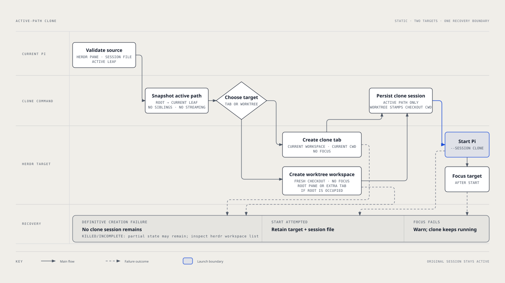
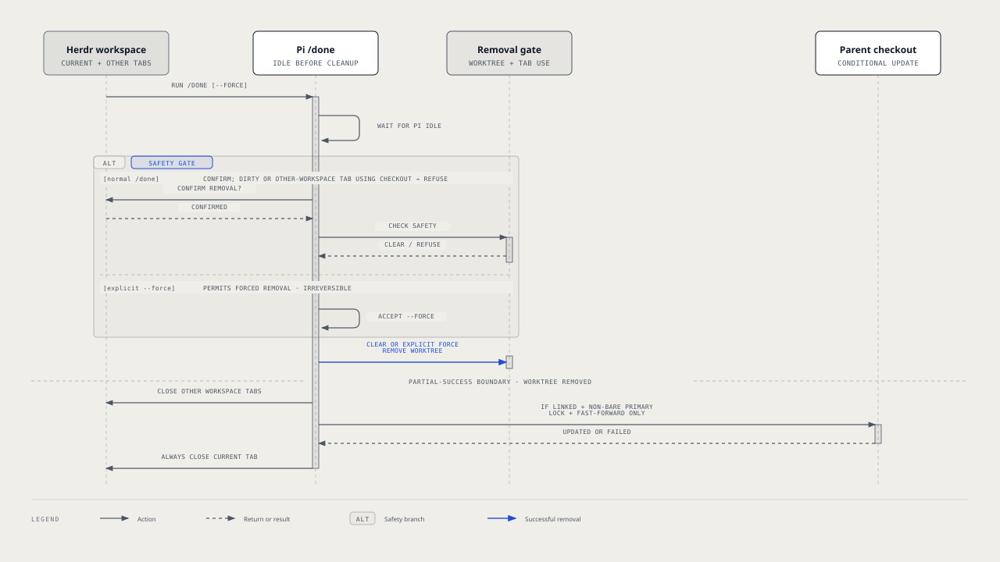

# `@henryqw/pi-herdr-clone`

Explore or implement from the current Pi conversation in a new Herdr tab or fresh Git worktree workspace. The clone copies only the active path, leaving sibling branches and the original session untouched. Finish linked-worktree tasks with `/done`, which removes the checkout, closes its workspace tabs, and fast-forwards its primary checkout when possible.

## Install

```bash
pi install npm:@henryqw/pi-herdr-clone
```

Requires the Herdr CLI and a Pi session running inside a Herdr-managed pane.

### Migrating from `@henryqw/pi-herdr-done`

Starting with version 2.1.0, this package includes `/done`; the separate `@henryqw/pi-herdr-done` workspace is retired. Remove old installs before upgrading to avoid duplicate `/done` registration:

```bash
pi remove npm:@henryqw/pi-herdr-done
pi install npm:@henryqw/pi-herdr-clone
```

For project-local installs, use `--local` on both commands. Remove any manually configured paths to `pi-herdr-done` as well, then restart Pi. `/done` keeps the same grammar and safety behavior; no session or configuration migration is needed.

## Use

Run `/clone-tab` to open a new Herdr tab with a clone of the active conversation path; the original session remains open.

| Surface | Type | Purpose |
| --- | --- | --- |
| `/clone-tab` | command | Clone the current conversation into a new tab of the current Herdr workspace. |
| `/clone-worktree` | command | Clone the current conversation into a new Herdr Git worktree workspace. |
| `/done [--force]` | command | Remove the current worktree and close its Herdr workspace tabs; `--force` skips confirmation and permits forced removal without checking for tabs in other workspaces. |

The active path runs from the session root to its current leaf when the command is invoked. Sibling branches and still-streaming assistant output are excluded. Both clone commands require a Pi session in a Herdr pane (`HERDR_ENV=1` and `HERDR_PANE_ID`) and validate the pane, session path, and current leaf before creating a target. If Pi has not written the session file yet, the commands clone the live session state. Neither command has configuration, and the original Pi session is not switched.

Commit or discard changes in a Herdr-managed linked worktree, then run `/done` and confirm. Normal removal refuses dirty worktrees and worktrees in use by another Herdr workspace. **`/done --force` can irreversibly delete uncommitted work and leave other workspaces' tabs pointing at the removed checkout.**

## Flow



### Clone a tab

1. Create an unfocused Herdr tab in the current workspace with the current working directory.
2. Start Pi in the tab's root pane with `--session <absolute-clone-file>`.
3. Focus the new tab after Pi starts successfully.

### Clone a worktree

1. Create a Git worktree-backed workspace with `herdr worktree create --workspace <current-workspace> --no-focus`. Herdr creates the branch from `HEAD` unless the name exists, checks out the worktree under its configured `worktrees.directory`, and opens it as a grouped workspace. If the current workspace is already a linked worktree, the command targets its repository's parent workspace because Herdr creates worktrees from the parent.
2. Wait briefly for a worktree-layout plugin, such as `herdr-plus`, to start its agent in the new workspace's root pane.
3. If the root pane is occupied, create an additional unfocused tab in the new workspace with the checkout as its working directory. The plugin's agent and the clone then coexist. Otherwise, use the root pane.
4. Copy the active path into a clone session stamped with the fresh checkout path as its working directory.
5. Start Pi in the chosen pane with `--session <absolute-clone-file>`.
6. Focus the clone's tab after Pi starts successfully.

### Finish a worktree



Normal `/done` asks for confirmation before waiting for Pi to become idle; declining leaves the checkout untouched. `/done --force` skips confirmation. Both wait for Pi to become idle before cleanup.

Normal cleanup checks whether a tab in another Herdr workspace is using the checkout, removes it with `git worktree remove <checkout>`, closes every other tab in the current Herdr workspace, and runs `git pull --ff-only` from the primary checkout when this was a linked worktree and the primary is non-bare. It closes the current tab last. Tabs using the primary checkout do not block removal or the pull. Concurrent completions serialize on locks around the worktree and primary checkout; clone creation shares the worktree lock.

## State and storage

Each clone is a separate Pi session file in Pi's session directory, containing only the active path. A tab clone uses the current working directory; a worktree clone uses the fresh checkout. Pi's session manager chooses the session directory. For a persisted source session, Pi names the clone file; before the source session has been written to disk, the extension creates and names the clone file in that directory.

## Limits and recovery

### Cloning

| Outcome | What remains and how to recover |
| --- | --- |
| Definitive target creation failure | A failed `/clone-tab` tab creation removes its clone session when cleanup succeeds; if cleanup also fails, the error names the leftover file. A `/clone-worktree` worktree-creation or pre-launch extra-tab-creation failure happens before a clone session is created. |
| Killed or incomplete worktree creation | Herdr may have retained partial workspace state. The error reports any returned IDs and suggests inspecting `herdr workspace list`. No clone session has been created yet. |
| Incomplete tab-creation response | The error reports known IDs. For `/clone-tab`, the clone session is retained and its path is reported. For `/clone-worktree`, the worktree is retained and no clone session exists yet. Inspect the target before manual cleanup. |
| Agent start attempted | The launch outcome may be unknown. Retain the target tab, panes, and session file; the error reports known IDs for recovery. |
| Focus failed after Pi started | Show a warning, but do not report the already-started clone as failed. Focus the clone tab in Herdr if needed. |

### Worktree completion

- `/done` refuses to remove a dirty worktree. Commit or discard changes first. `/done --force` passes `--force` to Git and can irreversibly delete uncommitted work.
- A tab in another Herdr workspace that uses this checkout blocks normal removal. `/done` lists the tab label, or its ID when no label is available. Close the tab and retry, or use `/done --force` only if you accept removing the checkout while that tab still refers to it. Tabs in other workspaces are not closed.
- The command requires Pi inside Herdr with `HERDR_ENV=1`, `HERDR_WORKSPACE_ID`, and `HERDR_TAB_ID` set.
- The primary checkout update runs only after worktree removal. If `git pull --ff-only` fails, for example because the primary has diverged or has local changes, the worktree is already gone and the current tab still closes. Resolve the primary checkout issue, then retry with `git -C <primary-checkout> pull --ff-only`.
