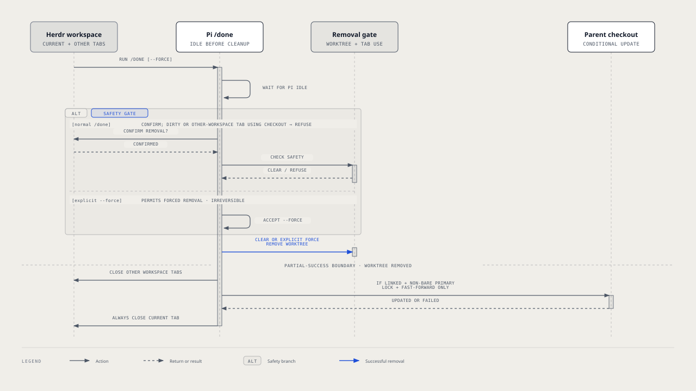

# `@henryqw/pi-herdr-done`

Finish a Herdr-managed linked worktree task by removing its checkout, closing its tabs, and updating the parent. One command performs cleanup and refuses unsafe removal unless you explicitly force it.

## Install

```bash
pi install npm:@henryqw/pi-herdr-done
```

Requires the Herdr CLI and a Pi session running inside a Herdr-managed linked worktree.

## Works with

**Improves.** [`@henryqw/pi-herdr-clone`](https://pi.henry.wang/extensions/pi-herdr-clone) creates the worktree workspace that `/done` later removes.

## Use

Commit or discard current changes, then run `/done` and confirm. The command waits for Pi to become idle before cleanup.

| Surface | Type | Purpose |
| --- | --- | --- |
| `/done` | command | Remove the current worktree checkout, close its Herdr workspace's tabs, and fast-forward the parent workspace. |
| `/done --force` | command | Same, even when the worktree is dirty or used by tabs in another workspace. |

## Flow



Both forms wait for Pi to become idle before cleanup. `/done` asks for confirmation. `/done --force` skips confirmation because the flag already states intent.

Normal removal runs:

```bash
git worktree remove .
herdr tab close <other-tabs-in-$HERDR_WORKSPACE_ID>
git -C <parent> pull --ff-only
herdr tab close "$HERDR_TAB_ID"
```

- The parent pull runs only when this session ran in a linked worktree with a non-bare primary.
- It fails safely when the parent has diverged.
- Parent tabs do not block worktree removal or the parent pull.
- Once removal succeeds, every tab in the current Herdr workspace closes, even when the parent pull fails.
- Concurrent completions serialize on a lock around the parent checkout.

## Limits and recovery

- Tabs in the current Herdr workspace close automatically.
- If a tab from another workspace still uses the current checkout, `/done` refuses and lists it by name. Use `/done --force` to remove the checkout regardless.
- The command requires Pi inside Herdr with `HERDR_ENV=1`, `HERDR_WORKSPACE_ID`, and `HERDR_TAB_ID` set.
- Dirty worktrees make `/done` fail. Commit or discard changes, or use `/done --force` to explicitly delete them.
