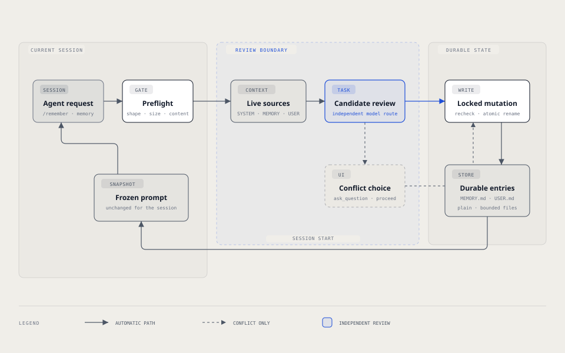

# `@henryqw/pi-memory`

Keep durable preferences and cross-project facts across Pi sessions, with a frozen snapshot in each session. Bounded Markdown controls prompt size without a hand-maintained knowledge tree.

Inspired by [Hermes Agent](https://github.com/NousResearch/hermes-agent) and its bounded `MEMORY.md`/`USER.md` cross-session memory pattern.

## Install

```bash
pi install npm:@henryqw/pi-ask-question
pi install npm:@henryqw/pi-task-models
pi install npm:@henryqw/pi-memory
```

Run `/task-models` and configure the `balanced` profile before adding memory. Open `/task-models` again and verify that `balanced` no longer says `not configured`.

## Works with

| Package | Relationship | Purpose |
| --- | --- | --- |
| [`@henryqw/pi-ask-question`](https://pi.henry.wang/extensions/pi-ask-question) | Required | Provides the validated conflict prompt. |
| [`@henryqw/pi-herdr-btw`](https://pi.henry.wang/extensions/pi-herdr-btw) | Improves | Marks side-thread children, suppressing parent-only memory injection and dream advice. |
| [`@henryqw/pi-task-models`](https://pi.henry.wang/extensions/pi-task-models) | Required | Provides candidate-review routes. |

## Use

Run `/remember I prefer concise release notes.` Pi proposes a suitable entry through a configured model task, then reviews the add. An unconflicted preference is saved in `USER.md`; a conflict asks you how to resolve it.

Read `~/.pi/agent/config/pi-memory/memory/USER.md` to confirm the saved entry. Start a new session to use its frozen snapshot.

| Surface | Type | Purpose |
| --- | --- | --- |
| `/remember <instruction>` | command | For humans: process an instruction into compact durable memory; semantic conflicts require user resolution; busy requests queue in FIFO order. |
| `/dream` | command | For humans: promote invariant memory instructions into the agent-global `~/.pi/agent/SYSTEM.md`. |
| `memory` | tool | For agents: add, replace, remove, or batch-edit entries across sessions. |
| `pi-memory/reviewCandidate` | model task | Reviews memory additions. |
| `pi-memory/prepareCandidate` | model task | Proposes a target and entry for `/remember`, or skips it. |
| `pi-memory/promoteEntries` | model task | Proposes one guarded `/dream` promotion. |

## Flow

### Candidate review

New single adds and batches containing an `add` are independently reviewed by the local `pi-memory/reviewCandidate` Model Task. It defaults to the shared `balanced` profile.



Candidate review gives the configured model live snapshots of agent-global `SYSTEM.md`, `MEMORY.md`, and `USER.md`. An initially missing `SYSTEM.md` is empty. Unreadable, oversized, or over-cap sources fail closed.

A SYSTEM file proven present during review cannot disappear later in that session. Restore it before the next add.

It resolves the configured Pi registry primary route, then fallback, through `/task-models`. It never substitutes the current session model. It accepts only verified bounded JSON evidence.

A missing shared task-model config warns once at session start. Configure `pi-memory/reviewCandidate` with `/task-models` before adding memory.

An overlap or contradiction pauses through the shared `ask_question` UI. Choose **Merge with existing entries**, **Discard the new entry, keep current**, or **Replace current entry**; the UI also offers **Something else.** for a custom answer. The recommended choice comes first: merge for overlap, replace for contradiction, and discard for SYSTEM conflicts. pi-memory never edits SYSTEM.md.

Exact duplicate single adds and duplicate-only add batches are idempotent and skip model review. For a single add conflicting with exactly one entry in the same store, approved merge or replacement is re-reviewed against the other sources and written under the store lock only if those sources remain unchanged. Discard writes nothing. Custom answers, cross-target or ambiguous conflicts, batches, cancellation, and non-interactive UI leave the candidate unwritten. pi-memory cannot resolve a SYSTEM.md conflict.

### `/remember`

`/remember <instruction>` uses the bounded `pi-memory/prepareCandidate` Model Task to propose a target and exact entry or decline the request. It checks for source changes, then saves through the same reviewed memory tool. It does not dispatch an open-ended instruction to the session agent. The configured `balanced` task-model profile must be available.

If Pi is busy, it queues the trimmed instruction. Once the response settles, it drains queued requests in FIFO order while the session remains idle, reading live entries for each. If the session starts, shuts down, or changes model during review, `/remember` rejects the write even when Pi provides no idle cancellation signal; retry in the current session. Unsuitable project-specific, temporary, trivial, or otherwise unsuitable content is refused.

### `/dream`

Pi recommends `/dream` when memory is non-empty and no previous dream is recorded. It also recommends it when memory is non-empty and the last dream was over 30 days ago.

It recommends `/dream` when either store is at least 70% full and the last dream was at least 7 days ago.

`/dream` uses `pi-memory/promoteEntries` to propose one exact edit to the agent-global `~/.pi/agent/SYSTEM.md` and the whole entries represented by the result. It previews the proposal for approval in the interactive UI. After approval, it checks that SYSTEM and both memory stores are unchanged, writes SYSTEM first, then removes the selected entries. A failed SYSTEM write removes nothing. If removal fails after SYSTEM was updated, rerun `/dream` to reconcile; the timestamp is not advanced. Successful runs record their time in `~/.pi/agent/config/pi-memory/dream.json`.

SYSTEM.md must already exist, be readable, and not be a symlink. Establish it deliberately and completely: a partial SYSTEM replaces Pi's default prompt. A SYSTEM edit takes effect in a new session, not the current frozen snapshot. `/dream` cannot run without an interactive UI or a configured `balanced` task-model route. If Pi supplies a cancellation signal, commands stop before writing when it is aborted; Pi may provide no signal while idle. Once a SYSTEM edit is saved, entry removal continues so the promotion can be reconciled on retry.

### Per-turn memory check

Final memory qualification remains a current-session-agent workflow; `/remember` and `/dream` use Model Tasks for semantic proposals and extension code for writes.

Each turn's shorter memory check asks the current agent to save newly learned durable user identity, preferences, or corrections to `target=user`, and stable cross-project environment or workflow facts to `target=memory`.

Use the memory tool immediately only when something qualifies. Save inferred habits only after two independent signals from the conversation and/or existing profile. Skip project- or repository-specific facts, task-local behavior, progress, and temporary preferences.

## Config

Package-owned: `~/.pi/agent/config/pi-memory/config.json`. You write this optional file; pi-memory reads it at session start and never creates or rewrites it. All fields are optional. A missing file uses defaults. Start a new session for config changes to take effect.

| Name | Description | Values | Default |
| --- | --- | --- | --- |
| `directory` | Sets the folder for both memory stores. | Non-empty absolute path without control characters. | `~/.pi/agent/config/pi-memory/memory` |
| `memoryCharLimit` | Caps `MEMORY.md` by character count. | Safe integer from 1 to 100000. | `8800` |
| `userCharLimit` | Caps `USER.md` by character count. | Safe integer from 1 to 100000. | `5500` |

Malformed JSON, invalid UTF-8, files over 64 KiB, non-object roots, unknown keys, or out-of-range values fail initialization with an error naming the problem; persistent memory is disabled for that session. Fix the file and start a new session. The file is never rewritten.

## State and storage

| Store | Scope | Default cap |
| --- | --- | --- |
| `MEMORY.md` | Global agent notes shared across all projects. Do not store project-specific facts here; they belong in the repository. | 8800 characters |
| `USER.md` | User profile. | 5500 characters |

Each file holds entries delimited by `§` and is size-capped. At session start, both stores are captured. Later edits do not alter injected memory.

During a session, pi-memory remembers each store file proven to exist. This includes valid, invalid UTF-8, oversized, and symlinked files.

If a proven store disappears, writes stay blocked until you restore it. A path never confirmed present can be repaired and created normally. A new session starts new presence tracking.

Read `<directory>/MEMORY.md` and `<directory>/USER.md` to inspect live state.

Backups and the lock file live outside `directory`, under `~/.pi/agent/config/pi-memory/backups/`.

Point `directory` at an iCloud Drive or Obsidian-vault-synced folder. The synced vault only carries files. pi-memory owns the file format and treats the remote as opaque storage, so no merge logic runs on the Pi side.

## Limits and recovery

A configured cloud-synced directory can be read outside Pi. Review [`ADR 006 — pi-memory global store threat model`](https://github.com/HenryQW/pi-harness/blob/main/docs/adr/006-pi-memory-global-store-threat-model.md) before pointing it at a shared or cloud-synced path.

When a write would exceed a store's cap, the tool rejects it and reports current usage.

Consolidate with one batch that removes or shortens stale entries and adds the new entry together. A batch checks only the final size. A batch accepts at most 100 operations. A complete serialized mutation cannot exceed 1,000,000 UTF-8 bytes.

Both limits are checked before source loading or review. Calls over either limit do not write.

An external edit or sync can push an on-disk file over its cap. The session snapshot then omits the overflow and warns instead of injecting it.

Startup lists at most three unexpected regular filenames in `directory`. It stops on the fourth and reports `at least four unexpected files`. Only `MEMORY.md` and `USER.md` are loaded; reconcile or remove the unexpected files.
