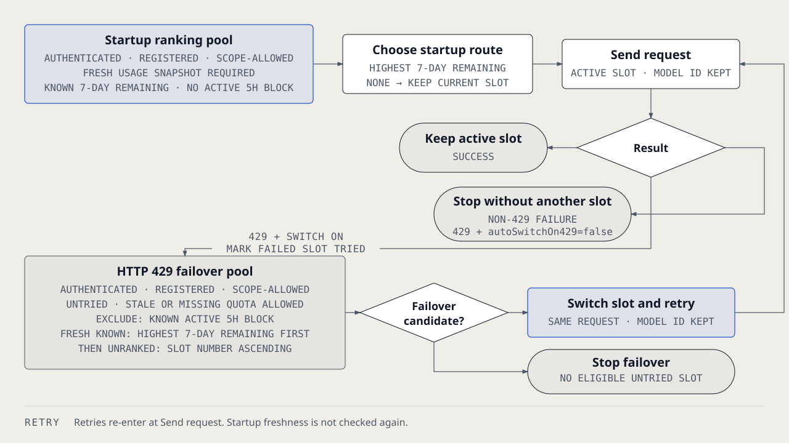

# `@henryqw/pi-multi-codex`

Add multiple ChatGPT Codex OAuth accounts and start new Pi work on the slot with the most weekly quota.


## Why

- **Created for**: Pi users who work across more than one Codex subscription.
- **Advantage**: Quota-aware routing starts with the eligible slot that has the most remaining seven-day quota. With automatic switching enabled, Pi can retry an HTTP 429 response on another eligible slot.

## Install

```bash
pi install npm:@henryqw/pi-multi-codex
```

## With

| Package | Why |
| --- | --- |
| [`@henryqw/pi-footer`](https://pi.henry.wang/extensions/pi-footer) | Improves. Shows the active slot's quota or five-hour block in the footer. |
| [`@henryqw/pi-subagent`](https://pi.henry.wang/extensions/pi-subagent) | Improves. Isolated children keep Main's active Codex slot. |
| [`@henryqw/pi-task-models`](https://pi.henry.wang/extensions/pi-task-models) | Improves. Numbered slots share one profile route. |

## Use

Run `/login` and authenticate `OpenAI Codex` for slot 1 first. Run `/codex-add`, then run `/login` and select the new `OpenAI Codex #<n>` provider. Restart Pi or update model scope, then run `/codex-status`.

`/codex-status` lists the new slot. It shows cached quota when available, or `unavailable` until the first successful snapshot.

| Surface | Type | Purpose |
| --- | --- | --- |
| `/codex-add` | command | Create the next numbered slot, then authenticate that slot. |
| `/codex-status` | command | Show shared quota snapshots and five-hour blocks. Never waits on network. |
| `/codex-switch` | command | Pick an authenticated slot. |

A numbered slot is one Codex account position in Pi.



- The extension reads `auth.json`. It never writes or refreshes credentials.
- Before the first agent start, only fresh quota snapshots enter startup ranking. The slot with the most seven-day quota wins.
- After HTTP 429, failover can use authenticated, registered, scope-allowed, untried slots with stale or missing quota.
- Failover skips known active five-hour blocks. It ranks fresh known quota first, then unranked slots by slot number.
- Routing preserves the model ID.
- During one agent run, each eligible slot is tried at most once after HTTP 429 responses.
- Automatic retry stops when no untried eligible slot remains.
- The footer shows the active slot's fresh quota or five-hour block.
- Scoped sessions can switch only to exact scoped aliases.

## Config

Automatic HTTP 429 switching is on by default. To disable it, create `~/.pi/agent/config/pi-multi-codex/config.json`:

```json
{
  "autoSwitchOn429": false
}
```

The config must contain only `autoSwitchOn429` as a boolean. Invalid config is preserved and disables automatic switching.

Generated credential-free quota cache: `~/.pi/agent/config/pi-multi-codex/usage.json`. The extension maintains it.
