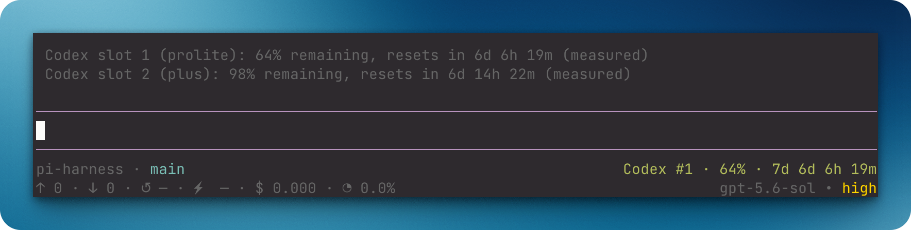

# `@henryqw/pi-multi-codex`

Add multiple ChatGPT Codex OAuth accounts and start new Pi work on the slot with the most weekly quota.



## Why

- **Created for**: Pi users who work across more than one Codex subscription.
- **Advantage**: Fresh quota data selects an eligible slot before work starts without changing active sessions.

## Install

```bash
pi install npm:@henryqw/pi-multi-codex
```

## With

| Package | Why |
| --- | --- |
| [`@henryqw/pi-footer`](https://pi.henry.wang/extensions/pi-footer) | Improves. Shows the active slot's quota or five-hour block in the footer. |
| [`@henryqw/pi-subagent`](https://pi.henry.wang/extensions/pi-subagent) | Improves. Isolated children keep Main's active Codex slot. |
| [`@henryqw/pi-task-models`](https://pi.henry.wang/extensions/pi-task-models) | Improves. Numbered slots share one profile route. |

## Use

Run `/codex-add` and finish OAuth login. Restart Pi or update model scope, then run `/codex-status`.

The new numbered slot appears with its latest shared quota snapshot.

| Surface | Type | Purpose |
| --- | --- | --- |
| `/codex-add` | command | Create the next numbered slot, then authenticate that slot. |
| `/codex-status` | command | Show shared quota snapshots and five-hour blocks. Never waits on network. |
| `/codex-switch` | command | Pick an authenticated slot. |

A numbered slot is one Codex account position in Pi.

- The extension reads `auth.json`. It never writes or refreshes credentials.
- Before the first agent start, a fresh snapshot routes a managed Codex model to the eligible slot with the most seven-day quota.
- A slot whose reported five-hour window has reached 100% is excluded until that window resets.
- Routing preserves model ID and never changes in-progress work.
- The footer shows the active slot's fresh quota or five-hour block.
- Scoped sessions can switch only to exact scoped aliases.
- Restart or update model scope after adding a slot.

Generated credential-free quota cache: `~/.pi/agent/config/pi-multi-codex/usage.json`. The extension maintains it.
