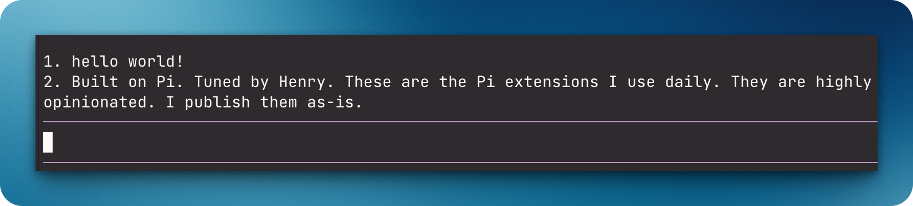

# `@henryqw/pi-notes`

Keep persistent post-it reminders in a Pi widget. Manage them with slash commands.



## Why

- **Created for**: Keep a few brief post-it-style reminders visible per worktree without leaving the Pi session.
- **Advantage**: Notes stay intentionally bounded and visible instead of becoming clipboard storage or history.

## Install

```bash
pi install npm:@henryqw/pi-notes
```

## Use

| Surface | Type | Purpose |
| --- | --- | --- |
| `/note <text>` | command | Add a note for current Git worktree (max 4). |
| `/note-rm` | command | Pick a note from current worktree to remove. |
| `/note-clear` | command | Clear current worktree's notes. |

- Each Git worktree has separate notes.
- The widget numbers notes above the editor and shows at most two lines per note.
- Each worktree has at most four notes.
- Empty worktrees show no widget.
- Stale files for removed repositories and worktrees are deleted silently when a session starts or notes change.

Each worktree file is validated as untrusted data. Malformed files are preserved. They block mutation for the affected worktree until fixed or reset with `/note-clear`.

## State

The extension generates `~/.pi/agent/config/pi-notes/<worktree-sha256>.json` for command-managed notes in one Git worktree.
