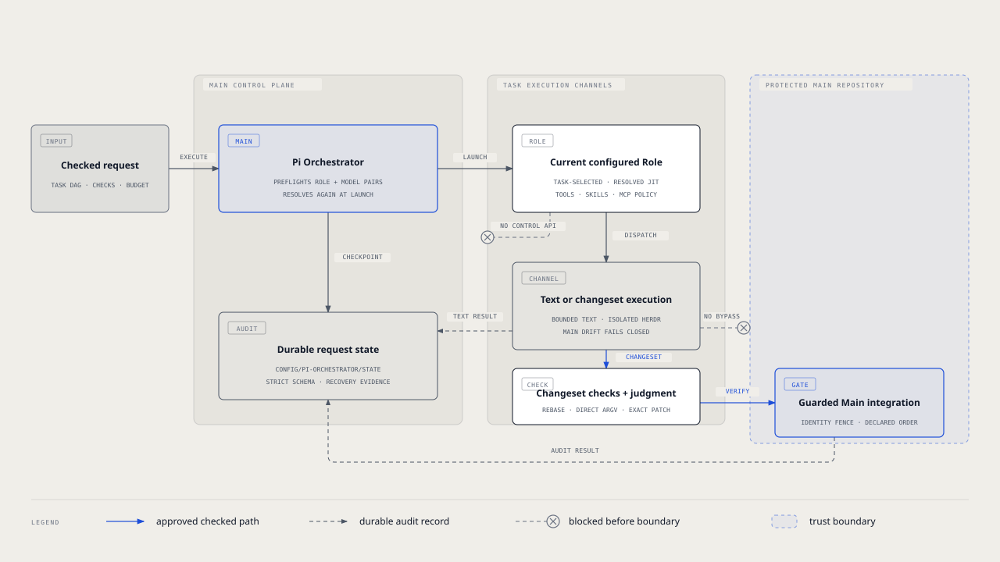

# `@henryqw/pi-orchestrator`

Run durable, checked local implementation graphs from Pi Main. Independent tasks run in parallel. Dependencies run in later waves.

This package is the sole owner of that checked protocol. `delegate_task` remains lightweight generic delegation.

## Install

Settle every unfinished Auto DAG run before upgrading. Old Auto DAG state is inert. Pi Orchestrator does not read or migrate it.

The repository installer installs all selected packages first. When Pi Orchestrator was selected, it then removes only the exact `npm:@henryqw/pi-auto-dag` source if present. A missing source needs no action.

Install the Main-side packages:

```bash
pi install npm:@henryqw/pi-task-models
pi install npm:@henryqw/pi-subagent
pi install npm:@henryqw/pi-orchestrator
```

### Requirements

- Use a clean Git worktree on an attached branch with a committed `HEAD`.
- Use Herdr `0.9.0` or newer, with protocol version 22 or newer. Run `herdr --version` to verify the installed version.
- Configure Pi task-model profiles for every requested model class. Run `/task-models` to verify the profiles.
- Use `@henryqw/pi-subagent` 16 or newer for Role launch, execution, worktrees, and exact review evidence.

## Works with

| Package | Relationship | Purpose |
| --- | --- | --- |
| [`@henryqw/pi-subagent`](https://pi.henry.wang/extensions/pi-subagent) | Required | Provides Role launch, execution, worktrees, and exact review evidence. |
| [`@henryqw/pi-task-models`](https://pi.henry.wang/extensions/pi-task-models) | Required | Provides configured profiles for every requested model class. |

## Use

Call `orchestrate_execute` with a bounded request. It runs the graph through checked integration in the local repository.

| Surface | Type | Purpose |
| --- | --- | --- |
| `orchestrate_execute` | tool | Start one durable checked task graph. |
| `orchestrate_status` | tool | Read one request and report workspace drift. |
| `orchestrate_resume` | tool | Retry, verify, or finalize an unfinished request. |
| `orchestrate_abort` | tool | Stop workers and abort an unfinished request. |
| `pi-orchestrator` | skill | Guide Main to choose generic delegation or checked orchestration. |

Use `delegate_task` for lightweight generic delegation. Use `orchestrate_*` when implementation needs durable state, checks, dependencies, integration, or recovery.

### Start a request

```json
{
  "id": "repair-auth",
  "goal": "Repair sign-in and prove the release is ready.",
  "budgetMs": 1800000,
  "tasks": [
    {
      "id": "auth-runtime",
      "modelClass": "balanced",
      "requirements": "Fix the sign-in failure without changing unrelated session behavior.",
      "deliverable": "A focused committed runtime fix.",
      "dependsOn": [],
      "checks": [
        { "command": "pnpm", "args": ["test", "--filter", "auth"] }
      ]
    }
  ],
  "finalChecks": [
    { "command": "pnpm", "args": ["typecheck"] }
  ]
}
```

## Flow

The graph runs ready tasks in waves. Independent tasks run in parallel. Dependencies run in later waves.

The architecture diagram shows the guarded path from the checked request through isolated Herdr work, direct checks, optional review, and Main integration.



### Execution and review

A request accepts one to eight tasks. Every task needs direct checks and an explicit model class.

`dependsOn` creates later waves. Tasks in one ready wave use separate worktrees and visible Herdr workers.

Preliminary validation uses checks only while the worker remains available. A settled implementation block or unchanged failed check can trigger one same-agent correction.

The worker then stops. The orchestrator rebases the candidate and reruns every task check directly, without a shell.

Add `judgment` only for a criterion that checks cannot decide. One read-only Reviewer runs after the rebase with exact private patch evidence. Its final response is mandatory. Zero findings must return exactly `PASS`; blank or other output fails.

## API

The package root exports its strict request and state schemas, runner contracts, checked Git runtime, Herdr host runtime, and composition helpers. The Pi entry point is `extensions/orchestrator.ts`.

## State and storage

State lives under `~/.pi/agent/config/pi-orchestrator/state/`, namespaced by repository and request ID. Do not edit state files.

## Limits and recovery

### Recovery actions

Use `orchestrate_status` after interruption or when a request needs attention. Then choose one reported action:

- `retry` continues pre-dispatch recovery or sends one eligible correction to the same agent. It never replaces a prompted agent.
- `verify` checks retained task work before integration or finishes pending cleanup.
- `finalize` reruns the final gate when Main still matches the recorded identity.

`orchestrate_abort` terminates owned workers and records an aborted request. It does not claim uncertain cleanup succeeded.

### Version 1 scope

Version 1 stops after checked integration in the local repository. It does not push, open or manage pull requests, run swarms, or support old protocols and state.

It does not use outboxes, delivery hosts, receipts, or broad transport machinery.
