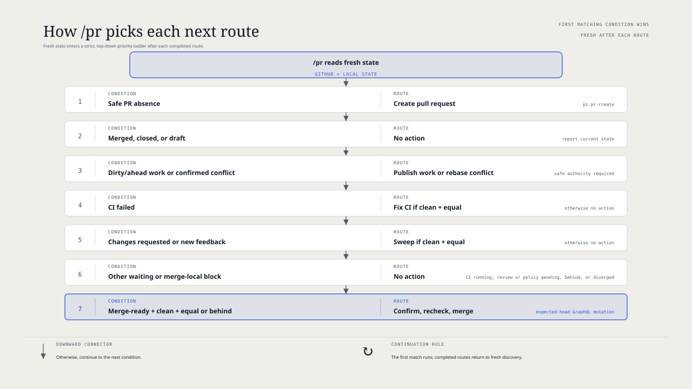

# `@henryqw/pi-pr`

Show the current branch pull request in the Pi footer and use `/pr` to run its next safe step.

## Why

- **Created for**: Check pull-request progress without repeated `gh` commands.
- **Advantage**: See the current pull request and its next step in one place.

## Install

```bash
pi install npm:@henryqw/pi-pr
```

Requires an authenticated GitHub CLI session (`gh auth login`) and a checkout on GitHub.com or GitHub Enterprise. The PR hostname selects its GitHub API host. It works in generic Pi sessions outside Herdr.

The comment sweep resolves its bundled helper and references from the installed package skill path. It does not require an external `jq` executable.

## With

[`@henryqw/pi-footer`](https://pi.henry.wang/extensions/pi-footer) improves this package by showing its pull-request status in the footer.

## Use

Run `/pr` in a GitHub checkout. Pi opens the current branch pull request when one exists.

If none exists, Pi starts the bundled creation workflow instead.

| Surface | Type | Purpose |
| --- | --- | --- |
| Footer | ui | Show a linked `PR #number` and one plain-language status. |
| Widget hint | ui | Show at most one hint for the next `/pr` step. |

Footer statuses include `N unresolved`, `draft`, `open`, `approved`, `CI running`, `CI failed`, `changes requested`, `base update required`, `merge conflict`, `merge-ready`, `merged`, and `closed`. Colors support the text; they do not carry meaning alone.

Use `/pr` without arguments. It reads the current branch pull request and local state, then runs one route.



## Routes

| Current condition | `/pr` route |
| --- | --- |
| No current-branch pull request, including no upstream push target | Start pull-request creation. |
| Base update required or merge conflict | Update from the exact base when the tree is clean and local HEAD equals the PR head. |
| Changes requested or unresolved review threads | Run the package comment sweep when the same local prerequisite holds. |
| CI failed | Run the CI fix workflow when the same local prerequisite holds. |
| No-action state | Report the state without taking action. |
| Merge-ready pull request | Ask for final confirmation, recheck fresh state, and merge directly if confirmed. |

`pi-pr-create` honors an existing configured push target. Without one, it pushes a captured OID to the local branch ref on `origin` and sets upstream.

Current-branch discovery matches the exact push repository and ref. It finds a fork-head PR whose base is an upstream repository. A unique historical match uses the exact remote push-ref OID, not local HEAD.

A no-action state includes a draft, merged or closed pull request, running CI, pending review, or blocked merge policy. It also includes a mutating workflow whose tree is dirty or whose local HEAD differs from the PR head.

## Route priority

A missing pull request uses creation. For an existing pull request, the first matching condition wins:

1. Merged, closed, or draft: no action.
2. Base update required or merge conflict. Run only with a clean tree and equal local and PR heads.
3. Changes requested or unresolved review threads. Apply the same local prerequisite.
4. CI failure. Apply the same local prerequisite.
5. Waiting or local safety block: no action.
6. Merge-ready: allow clean local HEAD equal to or behind the PR head. Confirm, then merge directly.

Ordinary conversation comments do not trigger a route or block a merge. Changes requested and unresolved review threads can select the package comment sweep.

## Refresh

The footer and widget load at session start and poll every 30 seconds. Polling updates presentation only and may be stale. Presentation uses route priority, so draft appears before running CI. `/pr` reads fresh state before routing or merging. The command is authoritative for actions.

## Safety limits

- `/pr` takes no arguments and does not open a browser.
- It does not run `/done` or `/sweep`.
- Polling does not auto-triage comments or start a workflow. The package comment sweep runs only when an explicit `/pr` selects it.
- It does not enable auto-merge or add a merge queue.
- It does not rebase the local branch, force-push, delete branches, or clean up worktrees.
- Creation, discovery, and comment-sweep pushes require one unambiguous push URL for the configured destination.
- Presentation fetches use that exact push URL and exact advertised OID. They do not use shared fetch state.
- Strict status checks in legacy branch protection or applicable repository rulesets require a base update.
- Applicable ruleset restrictions intersect repository-wide merge methods. An empty intersection stops the workflow.
- Before merge, `/pr` fetches the exact head OID from the validated push URL without shared fetch state.
- A merge, rebase, cherry-pick, revert, or sequencer state blocks direct merge, even when `git status` is empty.
- Before a comment-sweep push, it revalidates the configured destination, full PR identity, and local HEAD. It pushes the captured OID.
- An already-published local HEAD needs no second push.
- Direct merge requires final confirmation and a fresh readiness check.
- Only authenticated GitHub.com and GitHub Enterprise repositories are supported.
