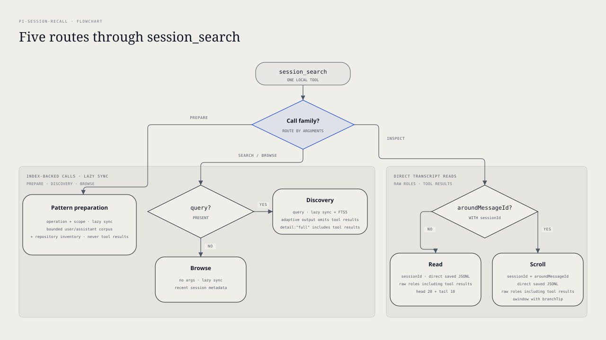

# `@henryqw/pi-session-recall`

Find decisions and context in past Pi sessions through a local FTS5 index.

Saved transcripts are not injected on every turn. The active tool registration still adds standing prompt cost through its schema, descriptions, and guideline. Returned content enters active model context.

The bundled `pi-session-pattern-miner` skill prepares one bounded sample. The model then finds repeated work that may deserve automation.

## Install

```bash
pi install npm:@henryqw/pi-session-recall
```

## Use

Start a progressive search with a distinctive keyword query:

```json
{ "query": "database migration rollback" }
```

Discovery returns ranked metadata and snippets. Use a result's `path` and `matchMessageId` to scroll for the relevant messages.

Prepare a repository-scoped pattern-mining sample with one call:

```json
{
  "operation": "prepare-pattern-miner",
  "scope": "repository",
  "limit": 10
}
```

Use `scope:"all"` for cross-repository work. It still returns the corpus when repository inventory is unavailable.

Use the discovery result's `path` and `matchMessageId` for a follow-up scroll:

```json
{
  "sessionId": "<result path>",
  "aroundMessageId": "<result matchMessageId>",
  "window": 10
}
```

The follow-up returns up to ten messages before and after that anchor on the selected branch.

| Surface | Type | Purpose |
| --- | --- | --- |
| `session_search` | tool | Search, inspect, or prepare a bounded mining corpus from past sessions. |
| `pi-session-pattern-miner` | skill | Find repeated work and choose the smallest useful automation. |

BM25 is a text-ranking method. Discovery returns index metadata; READ and SCROLL retrieve messages from saved session files.

| Mode | Call | Result |
| --- | --- | --- |
| Pattern preparation | `operation:"prepare-pattern-miner"` + `scope:"repository"` or `scope:"all"` | Up to ten recent lineage-unique sessions plus repository inventory. The default limit is 10. Repository scope includes exact and descendant `cwd` values, filters before the limit, and excludes the current session file. |
| Discovery | `query` | BM25-ranked metadata and snippets. Each result includes `path` and `matchMessageId` for a follow-up SCROLL. Start with keywords, then narrow the query before scrolling. |
| Scroll | `sessionId` + `aroundMessageId` | Raw message roles, including tool results, within ±`window` ([1,20]) of the anchor. Re-anchor on the last or first message ID to scroll. Across forks, pass the previous response's `branchTip`; `aroundMessageId` only centers the window and must lie on that branch. |
| Read | `sessionId` | Raw message roles, including tool results, from the session. Large sessions return head 20 + tail 10. Oversized content is bounded to 50k characters and marked with `contentTruncated`. |
| Browse | no args | Recent sessions with path, name, cwd, started date, and preview. |

In the interactive TUI, the collapsed tool block shows the last five visual lines and the earlier-line count. Press `Ctrl+O` to expand the full bounded response. The model always receives the complete tool result.

### Skills

Run `/skill:pi-session-pattern-miner` to find repeated workflows in past sessions. The skill makes one preparation call before interpretation.

It treats one lineage as one source. It requires two independent examples before recommending automation. A requested topic gets a focused confirmation search even when the prepared sample does not contain it.

After clustering, the skill always checks current candidate-relevant package manifests, scripts, skills, and instructions. It abstains if it cannot check them safely.

### Repository inventory

Repository inventory contains discovery hints. It is never proof that a file owns a workflow. It does not verify the current worktree.

Package scripts, executable paths, and instruction paths come from stage-0 entries in the Git index. Package content comes from indexed blobs. Git reads the objects locally in one check batch and one content batch. Lazy object fetching and replacement refs are disabled. Inventory never opens working-tree package paths.

Executables need index mode `100755`. Instructions need a recognized name and a regular-file index mode.

Skills come from Pi's effective command registry. Their canonical source paths must stay inside the repository.

Available inventory includes this provenance:

```json
{
  "packageScripts": "git-index",
  "executableScripts": "git-index",
  "agentInstructions": "git-index",
  "skills": "pi-effective-registry"
}
```

It also sets `worktreeVerified:false`. Staged adds, changes, and deletes affect the snapshot. Unstaged changes, deletions, mode changes, symlinks, and untracked files do not.

Inspect the current candidate files before assigning ownership. Abstain if targeted current-file checks cannot be done safely.

## Flow



Search makes no model calls.

### Query and index

- Prefer distinctive identifiers, package names, issue numbers, or uncommon terms. Use quoted phrases only when exact wording is known.
- The FTS5 trigram index uses AND for multiple words by default. Use `OR` for breadth, quoted phrases for exact matches, and `NOT` to exclude. Wildcards help only stems at least three characters long.
- Only user and assistant text is indexed. Thinking blocks and tool output are not searchable.
- For message text over the 20,000-character indexing budget, only the first and last regions are indexed. The middle is omitted. Phrases and `NEAR` cannot cross those regions, but ordinary AND terms can.
- `sessionId` must be a `.jsonl` file under the Pi sessions directory.

### Context and sync

Discovery excludes the current session file when its path is available. Forked sessions collapse into their parent when both match.

Before browse, discovery, or pattern preparation, the extension lazily syncs the index from the session tree.

Pattern preparation reports `sync.walkComplete`, `sync.backlogRemaining`, and `sync.complete`. `sync.complete` is true only after a complete walk with no backlog.

### Retrieval safety

Discovery returns no transcript content. Use its `path` and `matchMessageId` with SCROLL for targeted raw retrieval. READ and SCROLL include tool-result messages when present.

Pattern preparation returns only non-empty user and assistant text. It never returns thinking blocks or tool-result content. Preparation keeps citation and lineage metadata when a source cannot be read.

Historical tool output may contain secrets or other sensitive data. Raw retrieval places that output in active model context.

## State and storage

The extension maintains the derived SQLite search index at `~/.pi/agent/config/pi-session-recall/index.db`.

This is derived state. Delete it and it rebuilds from your session files.

The index and transcript reads stay local. Transcripts are read in place. Returned content follows the data path of your configured model provider.

## Roll back

Pin the previous release:

```bash
pi install npm:@henryqw/pi-session-recall@2.1.1
```

No index migration or cleanup is needed.

## Limits and recovery

Lazy index sync can fail while walking the session tree. Results still come from the current index and can be partly updated or stale. Files found before failure may have new content, while rows for files the walk did not reach stay stale.

- A partial walk returns top-level `syncWarning`: `{kind:"incomplete-walk"}`. Indexed-but-unseen paths are never purged in that case.
- A total sync failure returns top-level `syncWarning`: `{kind:"sync-failed", error}` with the capped failure message.
- The warning is omitted after a completed sync.

Session directories whose encoded path starts with `--tmp-` or `--private-tmp-` are never indexed. These sessions run from `/tmp` or `/private/tmp`.

Session files over 32 MiB are excluded from indexing and hydration. Discovery cannot newly find them.

READ and SCROLL return an explicit size error. Discovery returns the indexed metadata even when a source file changes afterward.

Pattern preparation runs one sync pass. A positive backlog or incomplete walk limits the sample and sets `sync.complete:false`. A total sync or required repository-inventory failure returns an explicit tool error.

Repository scope fails outside Git or when repository inventory fails. All scope still returns its corpus in both cases.

Outside Git, all scope sets `inventory.available:false` with `reason:"not-a-git-repository"`. On a repository inventory error, it uses `reason:"inventory-failed"`. Cancellation always aborts the call instead of returning unavailable inventory.

Preparation rejects `query`, session cursors, or `window` in the same call. It also rejects `scope` without the operation.

Preparation output stays within 50,000 serialized characters. Inventory uses at most 10,000 characters. Its `omittedCounts` report only omitted collection entries, and `inventory.truncated` reports those omissions.

Inventory fails if the Git root output exceeds 4 KiB or the raw index listing exceeds 8 MiB. It also fails on malformed index data, invalid UTF-8, conflict entries, unsupported package modes, Git errors, unexpected Git stderr, or bounded stream overflow.

Inventory accepts at most 512 package manifests. Each indexed manifest can be at most 1 MiB, and their declared sizes can total at most 16 MiB. One bounded batch checks all blob sizes before one bounded batch reads their content. Blob order, type, size, UTF-8, and exact output framing are checked before manifest data is parsed.

Session and top-level `contentTruncated` report transcript budget trimming only. Session `truncated` reports omitted middle messages.
