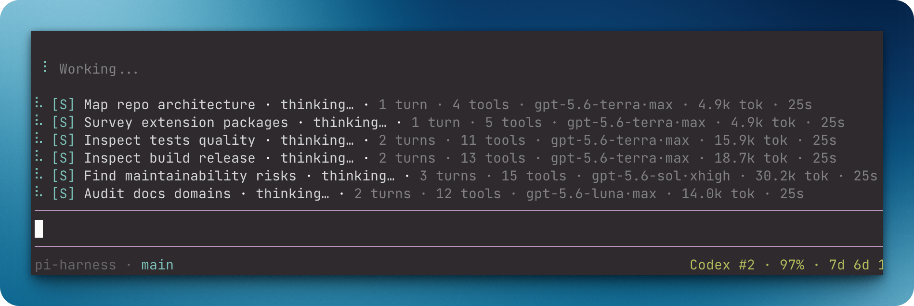
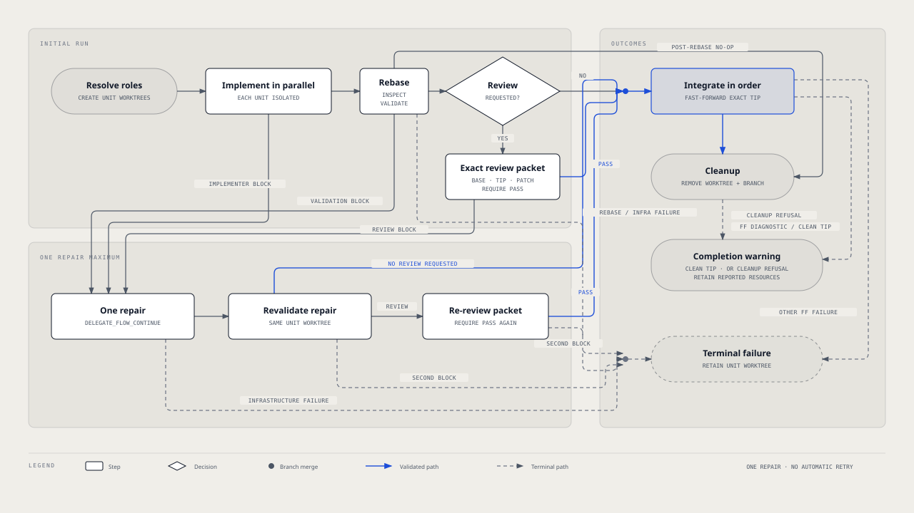

# `@henryqw/pi-subagent`

Main is the parent Pi session. It can delegate bounded single, parallel, and chained tasks, plus package-owned Git Flow work, to isolated Pi child roles.



## Why

- **Created for**: Delegate bounded work to isolated child Pi processes without losing Main's context.
- **Advantage**: Generic bounded delegation and a deterministic package-owned Git Flow use reusable Role launch policies for package authors.

## Install

```bash
pi install npm:@henryqw/pi-task-models
pi install npm:@henryqw/pi-multi-codex
pi install npm:@henryqw/pi-subagent
```

## With

| Package | Why |
| --- | --- |
| `@henryqw/pi-multi-codex` | Required. Children can use Main's active Codex slot. |
| `@henryqw/pi-task-models` | Required. Shared `fast` / `balanced` / `frontier` / `fav` routes. |

Model routing is not configured here. Children resolve routes through shared `@henryqw/pi-task-models` config at `~/.pi/agent/config/pi-task-models/config.json`, which stores only explicit task overrides. The local `pi-subagent/delegateTask` declaration supplies the omitted-class default.

The local config is optional and uses defaults quietly when missing. If shared task-model config is missing, pi-subagent warns once at session start because delegation needs a route.

## Use

| Surface | Type | Purpose |
| --- | --- | --- |
| `delegate_task` | tool | Generic bounded delegation in one single, parallel, or chain mode. |
| `delegate_flow` | tool | Package-owned parallel implementation and declared-order Git integration for 1–8 independent units. |
| `delegate_flow_continue` | tool | Repair the blocked Flow unit once in its existing worktree. |

All three delegation tools use Pi's built-in renderer. Its tool-execution block shows live updates and Pi's configured expansion hint; expanding shows the call and result content.

### `delegate_task`

Select exactly one shape:

```text
// Single
{ role, name, task, model?, modelClass?, background? }

// Parallel: 1–8 independent delegations
{ tasks: [{ role, name, task, model?, modelClass? }], background? }

// Chain: 1–8 dependent delegations
{ chain: [{ role, name, task, model?, modelClass? }], background? }
```

Main supplies every delegation's required `name`: a short description of about five words and fewer than 30 characters. Names must not contain C0/C1 control characters, including newlines and terminal escape characters.

`role` and explicit `model` values must not contain C0/C1 control characters.

#### Model routing

1. `modelClass` selects a route. It is `fast`, `balanced`, `frontier`, or `fav`.
2. An omitted class uses pi-subagent's `pi-subagent/delegateTask` declaration. Its default is `fast`.
3. The route supplies the model and exact thinking level.
4. An explicit `model` is `provider/modelId`. It replaces only the route model and must support its thinking level.

`background` applies to the whole selected mode. It is never a per-delegation field.

The transient status widget renders one line per child with: status glyph, bracketed uppercase role initial (`[I]` for `implementer`, `[R]` for `reviewer`, and likewise for custom Roles), Main-supplied short name, activity (thinking… or active tool with elapsed time and path basename), and metrics (completed turns, started tools, compact `model·thinking` pair, tokens, total duration). Rows are ordered active-first (working items first, stable insertion order for the rest). A hard six-physical-line maximum applies: when total items are six or fewer, all child rows render; above six, five child rows plus one status-aware overflow line render (`… N more · X working · Y complete · Z failed · W stopped`). Terminal rows clear on the next real user input; active rows persist until the child settles. It is separate from Pi's built-in tool-execution block.

#### Modes, limits, and isolation

- Parallel mode starts entries concurrently, waits for every entry, and reports them in input order.
- Chain mode is sequential and fail-fast. Each literal `{previous}` receives only the immediately preceding successful assistant output.
- Foreground failures throw after retaining bounded sibling and recovery evidence.
- One tool call has one aggregate 50 KiB Main-visible transport cap. It is not 50 KiB per child.
- Background workflows are session-scoped. Session shutdown or reload aborts them and may deliver only recoverable-work evidence or no follow-up message.
- Each delegation resolves its own Role, resources, route, and optional worktree request.
- When available, `isolation: worktree` gives each entry a deterministic separate worktree. Non-Git or unborn-`HEAD` contexts may use Main's cwd.
- Siblings and chain steps never implicitly share one created worktree.

See [Orchestration, isolation, and the public API](./docs/orchestration.md) for generic delegation, Flow behavior, and JavaScript composition examples.

### `delegate_flow`

Use Flow only for independent, commuting Git changes. Commuting changes can integrate in any order.

Flow accepts 1–8 uniquely identified units. Each unit has a required Main-supplied short `name`, bounded task, optional `modelClass`, direct command/argument validation gate, and optional non-empty `review` judgment criterion. Names must not contain C0/C1 control characters, including newlines and terminal escape characters.

```text
delegate_flow({ units: [{ id, name, task, modelClass?, validation: [{ command, args }], review? }] })
delegate_flow_continue({ guidance, modelClass? })
```



Objective verification is authoritative. Flow always inspects committed Git state and runs declared validation.

A unit without `review` skips review evidence and Reviewer launch. It fast-forwards its exact validated tip through the existing guarded `git merge --ff-only` path.

Add `review` only for judgment that automation cannot establish. That unit keeps the exact `{base, tip, patchPath}` protocol and requires exact `PASS` before the same integration path.

Only one memory-only Flow may be active. At start, it resolves and freezes the effective `implementer` Role, including a same-named user override. It resolves and freezes the effective `reviewer` only when at least one unit requests `review`.

An omitted `modelClass` uses the local `pi-subagent/delegateTask` declaration, which defaults to `fast`. A selected class resolves through its shared profile model-and-thinking route for the unit's Implementer and, when applicable, Reviewer.

Flow creates one Unit Worktree per unit before it launches Implementers. It runs Implementers in parallel, then processes settled results in declared order.

After integration, it removes the worktree and branch non-forcibly. A refusal is a completion warning with the retained worktree path and/or branch.

A rebase that drops all unit commits is a no-op. Flow validates it, skips Reviewer and merge, then cleans up ordinarily.

Implementer, validation, or review blocks can be repaired once through `delegate_flow_continue` in the same worktree. An omitted continuation `modelClass` retains the blocked unit's current class. A supplied class replaces it for that one repair.

Rebase and infrastructure failures are terminal. A reported fast-forward failure completes with its diagnostic as a warning only when Git left Main clean at the exact integrated tip.

Otherwise it is terminal and retains the affected worktree. Flow has no graph, saved recovery, automatic retry, aggregate review, or post-merge gate.

`delegate_task` keeps its generic isolation behavior. Flow uses the package-shipped Implementer by default and the package-shipped Reviewer only when a unit requests review; the built-in Scout is not part of Flow. Same-named user Roles remain supported overrides.

### Delegate UI summary

The transient status widget shows status glyph, role, status label, task summary, activity, and metrics for each child. Activity is `thinking…` or the active tool with elapsed time and path basename. Metrics are completed turns, started tools, model, thinking level, tokens, and total duration.

| Aspect | Behavior |
| --- | --- |
| Tool-execution block | Pi's built-in renderer: live updates and expandable call/result content |
| Widget rows | One line per child: glyph, `[role initial]`, short name, activity, metrics |
| Ordering | Active-first stable (working first, then insertion order) |
| Line cap | 6 physical lines max (≤6 items: all child rows; >6 items: 5 rows + 1 status-aware overflow) |
| Terminal retention | Active rows persist; terminal rows clear on next user input |

- Rows are active-first: working items first, then stable insertion order.
- The hard six-physical-line maximum shows all child rows for six or fewer items.
- Above six, it shows five child rows and one status-aware overflow line: `… N more · X working · Y complete · Z failed · W stopped`.
- Terminal rows clear on the next real user input. Active rows persist until the child settles.
- The final `delegate_task` block is deliberately minimal. It has bounded final summaries and role attribution for parallel and chain work. It shows only retained-worktree recovery paths.

## Config

pi-subagent owns the extension-named config directory `~/.pi/agent/config/pi-subagent/`. It holds two kinds of user-owned configuration.

One Markdown file belongs to each Role (see [Roles](#roles)). The other is its own optional JSON file below.

`~/.pi/agent/config/pi-subagent/config.json` controls the child pool and execution limits. All fields are optional. A missing file uses defaults without a warning.

| Field | Required | Possible values | Default |
| --- | --- | --- | --- |
| `maxSubagents` | No | Safe integer ≥ 1 | `5` |
| `maxTurns` | No | Safe integer ≥ 1 | `50` |
| `timeout.idleMinutes` | No | Positive number of minutes where minutes × 60 000 ms ≤ 2,147,483,647 | `10` |
| `timeout.maxMinutes` | No | Positive number within the same ms cap that must be greater than `timeout.idleMinutes`, otherwise the whole `timeout` object falls back to defaults | `30` |

- Excess children wait FIFO without consuming child timeout.
- A terminal response on turn 50 succeeds.
- An attempted continuation starts no model work and rejects with `turn_limit`.
- Before a continuing turn, the child gets one warning when completed turns reach 80%.
- It gets another warning when elapsed time reaches 80% of the maximum runtime.
- If both thresholds are first reached together, the child gets one combined warning.
- `PI_SUBAGENT_MAX_SUBAGENTS` overrides `maxSubagents` for the session. It must be a positive integer. An invalid value prevents the extension from loading and leaves `delegate_task` unavailable.

This JSON is read leniently. Malformed JSON, a non-object root, unknown keys, or invalid values are collected into one warning.

The affected settings fall back to defaults. The file is never rewritten.

### Role frontmatter

Each Role `.md` file in the same directory accepts these frontmatter fields:

| Field | Required | Possible values | Default |
| --- | --- | --- | --- |
| `name` | Yes | Non-empty text without C0/C1 control characters; unique across roles | — |
| `description` | Yes | Non-empty text without C0/C1 control characters | — |
| `tools` | Yes | YAML array of non-empty tool names | `[]` activates no base built-ins; trusted extension tools and caller additions still activate |
| `isolation` | No | `worktree` | None |
| `extensions` | Yes | YAML array of absolute paths, `~/…`, `file://`, or package sources (`npm:`, `git:`, `github:`, `https?:`, `ssh:`) | `[]` selects no Role extension bundle |
| `skills` | Yes | YAML array of non-empty Skill names | `[]` selects no separately named Role Skills; trusted extension Skills still load |
| body | Yes | System-prompt Markdown after the frontmatter | — |

An unreadable or invalid Role file fails role loading fast. Duplicate role names are rejected.

## Roles

The package ships three working built-in Roles. They are always available without configuration.

- `implementer`: focused edits requesting worktree isolation; commits completed scoped changes locally and never pushes or opens PRs without authorization
- `reviewer`: read-only correctness review of supplied plans or files, or—only when a Flow unit declares `review`—of Flow's exact `{base, tip, patchPath}` packet in its Unit Worktree; never edits or commits
- `scout`: read-only code and evidence mapping for one bounded task; never changes files

A same-named Markdown file in `~/.pi/agent/config/pi-subagent/` explicitly overrides the built-in default. The built-in `scout` is available to generic `delegate_task`; `delegate_flow` remains limited to its fixed Implementer/Reviewer protocol.

The repository also includes one optional inert sample:

- [`synthesizer`](./examples/roles/synthesizer.md): reconcile supplied reports

Copy it manually from your installed `@henryqw/pi-subagent` package if you want a starting point. npm installs ship the `examples/roles/` directory.

```bash
mkdir -p ~/.pi/agent/config/pi-subagent
cp <package-install-dir>/examples/roles/synthesizer.md ~/.pi/agent/config/pi-subagent/
```

Locate the install directory with `npm root` inside your project, or through Pi's package installation path.

The package never installs or writes Role configuration. After copying, edit or replace `synthesizer.md` as your own Role.

## Skill

The bundled [`pi-subagent-delegated-development`](./skills/pi-subagent-delegated-development/SKILL.md) Skill is Main-side planner and orchestrator policy only. `delegate_flow` owns its fixed Git mechanics and validation authority.

The Skill adds no runtime code, configuration, or Role installation. Generic orchestration remains outside the executor under [ADR 001](./docs/adr/001-composable-ephemeral-execution.md).

## Role, Skill, and resource trust

### Role resources

A Role explicitly owns base tools, extensions, named Skills, instructions, and optional `isolation: worktree`. Every launch installs its Role tool policy.

Named Skills resolve through Main's effective Pi Skill registry. Ambient extension and Skill discovery is disabled in children.

### Trusted extensions are not sandboxing

Selecting an extension explicitly selects a trusted atomic capability bundle, not just a provider path. Every tool it registers and every Skill supplied through its Pi package metadata or dynamic `resources_discover` loads alongside separately named Role Skills.

This is intentional. An extension may depend on its tools, Skills, lifecycle, and prompt behavior. Loading it permits that executable behavior and is not sandboxing.

Scope a child by selecting fewer trusted extensions. Finer-grained selection requires separate extension entry points or configuration, or an upstream split. pi-subagent does not infer or externally narrow undocumented dependencies.

### Tool filtering

- `tools: []` activates no base built-ins. Trusted selected extension tools and explicit caller tool additions still activate.
- `skills: []` selects no separately named Role Skills. Trusted selected extension Skills still load.
- `extensions: []` selects no Role extension bundle.
- Parent-only recursive orchestration tools and interactive `ask_question` are excluded from children.
- Explicit Role or caller tool names are verified against the child’s final filtered active registry after provider extensions finish `session_start`.
- Unavailable tool names fail before the first model turn with provider-extension guidance. Unavailable named Skills warn and skip.

## Library API

The package root exports Role loading and launch resolution, `createEphemeralSubagentExecutor`, and worktree helpers.

The executor is for code already running inside active Pi. It does not provide standalone Node.js Pi discovery or launch support.

It defaults to a hard limit of 50 turns. An attempted continuation rejects with `turn_limit` while preserving accumulated usage and bounded output.

After Pi exits, the executor drains inherited stdout and stderr normally. It destroys streams held by escaped descendants after a short inactivity deadline or one-second hard deadline, so they cannot retain a pool permit.

Use [`docs/orchestration.md`](./docs/orchestration.md#public-role-and-executor-api) for exact API behavior.

It includes a post-permit `prepare` example. The example uses `resolveRoleLaunch` with a caller-owned Model Task declaration against the latest Pi context.
