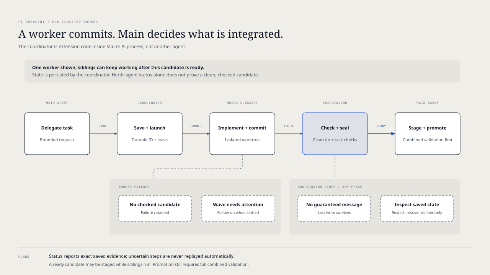

# `@henryqw/pi-subagent`

Delegate work to configured Pi Roles with [Herdr](https://herdr.dev/). Read-only direct tasks run in Herdr tabs in your current workspace; checked implementation runs in isolated Herdr worktrees. Both return a handle so Main can continue while they work.


## Install

```bash
pi install npm:@henryqw/pi-task-models
pi install npm:@henryqw/pi-subagent
```

Run `/task-models` and configure the `fast`, `balanced`, `frontier`, and `fav` routes you use.

Install `pi-mcp-adapter` only when a Role declares an MCP server allowlist:

```bash
pi install npm:pi-mcp-adapter
```

## Use



The coordinator is extension code running in Main's Pi process, not another agent. It persists the request, launches the Herdr subagent, checks its committed work, and reports saved results; Main chooses what to stage and promote. If a worker fails, the coordinator reports attention after the wave settles, not necessarily immediately while siblings work. If Main's Pi process stops, no follow-up is guaranteed: restart and run `/subagent recover` in the canonical repository to classify orphaned interruptions and send Main one recovery report. Main then uses `subagent_status` for exact evidence and deliberate next actions. A stale `running` state does not prove a worker is still active; interrupted or ambiguous actions are never replayed automatically.

Ask Main to delegate a bounded task, such as “Have a scout trace sign-in without editing files.” Main uses `delegate_task`; you receive progress and a result or an actionable failure while Main remains available.

Commands are for you; tools and the packaged skill are for Main. You do not need to call agent tools or manage candidate identities yourself.

In the TUI, the compact widget uses one row per visible agent/task: `D` or `I` marks direct or isolated work, and `[S]` or `[I3]` identifies the Role initial (plus the isolated model class: `1` fast, `2` balanced, `3` frontier, `*` fav). Direct rows show the launched model, thinking level, elapsed time, and measured session tokens (`— tok` until usage is available). Isolated rows show the recorded task state and any retained workspace; an aborted request with visible tasks has its own `request aborted` row and does not change their recorded statuses. A committed worker without a checked candidate can still show attention rather than readiness. Status glyphs use the active TUI theme, while the text still names the status without color. Herdr does not currently provide reliable live model, thinking, or token readings for those rows. Attention appears before ordinary work, with a `+N more` summary when direct rows overflow. A ready isolated candidate is **not promoted** to Main. Use `/subagent` or `subagent_status` for exact identities, failures, and recovery.

| Surface | Type | Purpose |
| --- | --- | --- |
| `/subagent` | command | Browse work, launch isolated status inspection in a separate Herdr tab with the `fast` model, or send/edit pending instructions. Requires interactive TUI or RPC; inspection also requires a Herdr-managed pane and a read-only `scout` Role. |
| `/subagent recover` | command | Classify orphaned isolated work in the current canonical repository and send Main one follow-up with request IDs, blockers, and reported next actions. No UI or Herdr pane required. |
| `delegate_task` | tool | Start read-only direct work or a durable isolated checked graph. |
| `subagent_status` | tool | Read durable isolated state and the exact allowed continuation without replaying work. |
| `subagent_resume` | tool | Perform the reported `retry`, `verify`, or `finalize` continuation; does not replace staging or integration. |
| `subagent_stage` | tool | Stage or resolve an exact candidate, or reject/revise it; rejection of a staged candidate freezes that generation. |
| `subagent_integrate` | tool | Advance staged dependents, refresh after clean Main drift, validate, record one correction, promote, reconcile interrupted promotion, clean up proven promotion, or explicitly release rejected/superseded resources. |
| `subagent_abort` | tool | Abort an isolated request only when no retained candidates or integration worktrees remain; cannot discard them. |
| `pi-subagent` | skill | Guide Main through delegation, authorization, checks, integration, and recovery. |

### How Main routes delegation

Main chooses the mode from your request; you do not need to select one. Words like “direct” and “isolated” can signal your intent, but the work determines the route. Main declares the chosen mode in every `delegate_task` call, and the extension never falls back between modes.

| Mode | Request that triggers it | Checkout behavior |
| --- | --- | --- |
| `direct` | Read-only research, analysis, or review | Opens non-focused Herdr tabs in Main's current workspace. No worktree is created. |
| `isolated` | Implementation or a checked task graph | Runs changesets in owned Herdr worktrees; Main selects, validates, and promotes exact candidates. |

Keep trivial mechanically verifiable work in Main. Keep tightly coupled changes under one owner rather than splitting by file count.

### Direct delegation

A read-only task:

```json
{
  "mode": "direct",
  "role": "scout",
  "name": "Map sign-in flow",
  "task": "Trace sign-in through session creation. Report files and risks. Do not edit files."
}
```

Direct mode selects exactly one shape:

```text
Single:   { mode: "direct", role, name, task, ... }
Parallel: { mode: "direct", tasks: [{ role, name, task, ... }] }
Chain:    { mode: "direct", chain: [{ role, name, task, ... }] }
```

Only Roles with known read-only tools and no extensions or MCP servers may run direct. Write-capable Roles and direct `changeset` tasks are rejected; use isolated mode for implementation. Parallel tasks run independently; chains replace each literal `{previous}` with the preceding successful answer and stop on failure.

The tool returns a task ID and first Herdr tab after launch, not the answer. The extension observes each worker and sends one result to Main when the workflow finishes. If Main is busy, Pi queues it after the current turn; if idle, it starts a turn. A blocked, stalled, unknown, or truncated result is not reported as success. Session switch or shutdown stops observation and preserves tab identities for recovery. Open `/subagent` on the session branch to inspect exact tabs, agents, and Pi session files, including tabs launched after the first. A recorded tab may no longer be running; locally observed work is labelled separately.

### Isolated checked graphs

An isolated request has one durable ID, one goal, and 1–8 typed tasks:

```json
{
  "mode": "isolated",
  "id": "refresh-repair",
  "goal": "Repair token refresh with exact checked evidence.",
  "tasks": [
    {
      "id": "inspect",
      "kind": "text",
      "role": "scout",
      "modelClass": "fast",
      "requirements": "Identify the refresh failure and relevant tests.",
      "deliverable": "A concise evidence report.",
      "dependsOn": [],
      "contextFrom": []
    },
    {
      "id": "repair",
      "kind": "changeset",
      "role": "implementer",
      "modelClass": "balanced",
      "requirements": "Implement the smallest correct repair.",
      "deliverable": "A committed candidate in the owned worktree.",
      "dependsOn": ["inspect"],
      "contextFrom": ["inspect"],
      "checks": [
        { "command": "pnpm", "args": ["test", "--", "refresh"] }
      ],
      "judgment": {
        "role": "reviewer",
        "modelClass": "balanced",
        "criterion": "The exact candidate fixes refresh and preserves unrelated behavior."
      }
    }
  ],
  "finalChecks": [
    { "command": "pnpm", "args": ["test", "--", "refresh"] }
  ]
}
```

`dependsOn` controls scheduling. `contextFrom` may name completed text tasks and preserves the declared order. Changesets require focused task checks; a graph with changesets requires final checks. A canonical root `package.json` test script is required: the runner adds `pnpm test` to final checks if missing, and Main runs it on the combined integration checkout before promotion. Checks and judgments bind to exact Git identities; candidate drift, Main drift, mutation during validation, ambiguity, or conflicts stop promotion and retain evidence.

`delegate_task`, `subagent_resume`, and `subagent_integrate advance` return a durable request ID after the wave is saved; productive work continues while Main is free. Main can do other work or end its turn instead of sleeping or polling. Pi sends a follow-up in the launching session whenever a checked worker becomes ready, and again when the wave finishes or needs attention. Use `subagent_status` if delivery is missed or you need exact current state.

The worker produces a committed candidate without tracked or untracked changes, then runs focused preliminary checks and optional judgment. Ignored generated files do not block candidacy, but prevent automatic worktree cleanup; inspect them before deleting retained work. The runner records each ready candidate immediately but **does not integrate it automatically**. Main can inspect `subagent_status` and use `subagent_stage` to select the exact candidate in an owned integration worktree while siblings are still working; conflicts are resolved there. Stage and resolve are available during an active wave, but rejection and revision wait for the wave to settle. `subagent_integrate` can advance dependent tasks from a staged snapshot, validate the combined tip with full root checks and optional final judgment after the wave settles, and promote it to Main only after exact validation. A definitive failed combined check/review allows one committed correction in the integration checkout followed by another validation. Main must explicitly promote; promotion and cleanup never silently discard retained work.

Open `/subagent` without arguments to pick work by label. The menu shows direct records on this session branch and isolated requests in the current canonical Git checkout (including requests launched in other sessions). Pick an isolated request and **Inspect status and recovery** to launch a non-focused Herdr tab with a read-only `scout` Role on the configured `fast` route. Its prompt contains bounded saved status (including retained paths, but not raw launch environment or session transcripts); the analysis stays in that tab and does not queue a Main turn. The tab and session file are recorded for recovery even if launch becomes uncertain. The read-only `subagent_status` tool remains Main's authority for exact identities before any stage or recovery action. If Herdr or the read-only fast route is unavailable, inspection fails without changing the request; Main can use `subagent_status`. Refresh or choose completed/history for older work. Invalid state IDs are warned about and preserved. Outside Git or when isolated inventory is unavailable, direct recovery still works. Browsing does not resume work or change resources.

For a locally active unsealed isolated changeset, choose **Send follow-up instructions** to open a native multiline editor; submission queues the instruction, not a completed revision. Choose **Edit queued instructions** to withdraw *all still-pending* instructions for that selected task before the editor opens. Their full text appears in FIFO order separated by blank lines. Explicit submission queues **one replacement** at the tail. Cancel leaves the withdrawn instructions removed; already-claimed instructions, initial prompts, and automatic corrections cannot be recalled. A worker may seal during editing: failed submission reopens the full submitted text for deliberate editing or copying, never automatically requeues it. Combined text above the single-instruction limit is preserved in the editor but rejected until shortened. Cancelling before withdrawal makes no change. Neither action touches Main's editor or Pi's global Option+Up queue shortcut. No-UI sessions can run `/subagent recover` or use agent tools for individual inspection and recovery.

A queued follow-up runs after the current turn settles and must produce a new clean commit that passes preliminary checks again. When no queued revision remains, the checked candidate seals immediately; there is no guaranteed post-completion editing window. Late follow-ups fail visibly.

### Isolated recovery

After a coordinator interruption, run `/subagent recover` once. It acquires the repository productive lease before changing any orphaned `pending` or `running` state, preserves unreadable state files and retained candidates, and reports blockers and existing continuations to Main without replaying prompts, merges, promotion, or cleanup. If another productive run holds the lease, it only reads status and reports the live owner; wait rather than taking over. Repeating the command is safe. Main uses `subagent_status` for exact identities and the recovery tools in the interface table above for deliberate decisions; the command never stages or promotes. Direct Herdr tab recovery remains in `/subagent`.

The following details describe exact identity and retained-work requirements.

Pass the exact `generation`, candidate (`taskId`, `attempt`, `candidate`) and `expectedTip` identities reported by status to stage; pass the generation and combined `expectedTip` to integrate. If Main advances cleanly before promotion, call `subagent_integrate refresh` with the recorded `expectedMain`, old `expectedTip`, and new clean `newMain`. Main must restage selected immutable candidates into the new generation and rerun combined checks. Dirty or divergent Main blocks refresh. Stale identities fail. If integration allocation was uncertain, `subagent_stage resolve` first proves the owned checkout is still at its base before starting the selected merge; otherwise it retains the intent. At most two integration worktrees may remain unreleased per request; a superseded generation is read-only. To release a superseded *clean* integration checkout, call `subagent_integrate` with `{ id, action: "release", generation, expectedTip }`, using that generation's last staged tip (or integration base when no stage completed). To release a rejected candidate after its worker has terminated and all generations using it are released, pass `{ id, action: "release", generation: <latest generation number, or 1>, taskId, attempt, expectedTip: <candidate tip> }`. Release persists each host/checkout/branch step, verifies ownership and cleanliness (including ignored files), and deletes the branch only if its ref still names the exact tip. Dirty, conflicted, changed, or uncertain resources remain for manual inspection; retry the same release after resolving the obstacle. Released checkouts free a retained slot; abort is available after every retained resource is released. Rejection can invalidate dependent work; if fresh dependent execution is impossible, start a new request instead of forcing promotion. Productive requests have no whole-run wall-clock deadline. Resume does not reset the recorded policy or correction count. Child limits, abort signals, process I/O, status inspection, exact termination, and cleanup retain finite safety bounds.

The extension never pushes, opens a pull request, publishes, deploys, force-cleans recoverable work, or silently falls back to Main.

## Config

pi-subagent owns `~/.pi/agent/config/pi-subagent/config.json`. A missing file silently uses defaults.

| Name | Description | Values | Default |
| --- | --- | --- | --- |
| `maxSubagents` | Concurrent direct Herdr workers and ephemeral child-process limit | Safe integer ≥ 1 | `5` |
| `maxTurns` | Provider-turn limit per child | Safe integer ≥ 1 | `50` |
| `maxTokens` | Optional token limit per child | Safe integer ≥ 1 | Unlimited |
| `maxCorrections` | Same-worker automatic corrections per isolated request | Safe integer ≥ 0 | `1` |
| `timeout.idleMinutes` | Direct worker and ephemeral child idle timeout | Positive and within Node's timer range | `10` |
| `timeout.maxMinutes` | Ephemeral child hard runtime | Greater than idle and within Node's timer range | `30` |

Limits come only from this global file. Request fields cannot override or replenish them. Existing durable requests keep their recorded policy, while a lower current correction limit can tighten recovery. There is intentionally no whole-run timeout setting.

Malformed or unreadable JSON, unknown keys, and invalid values block delegation with one actionable warning. The file is preserved and never rewritten automatically.

### Roles

Role Markdown lives in `~/.pi/agent/config/pi-subagent/` and requires frontmatter plus a Markdown system prompt.

| Field | Requirement |
| --- | --- |
| `name`, `description` | Required non-empty text without terminal control characters |
| `modelClass` | Optional `fast`, `balanced`, `frontier`, or `fav` default |
| `tools` | Required array of base tool names; `[]` selects none |
| `extensions` | Required array of trusted absolute paths or supported package sources |
| `skills` | Required array of effective Pi Skill names |
| `mcps` | Optional exact MCP server names; omitted or `[]` denies MCP access |
| body | Required system instructions |

Roles describe responsibility and capabilities. They do not choose isolation; each request does. A same-named user Role overrides a built-in Role. The package ships `implementer`, `reviewer`, and `scout`.

Children disable ambient extension and Skill discovery. Only declared resources and required internal policy adapters load. Missing Skills, tools, MCP servers, Roles, or routes fail before productive work starts. Main-only delegation and recovery tools plus `ask_question` are excluded from children.

## API

The package root exports the Role loader and launch APIs, the FIFO ephemeral executor, child-worktree helpers, exact review and working-change evidence helpers, checked isolated schemas, runtimes, and runner types.

`createEphemeralSubagentExecutor` accepts global concurrency, turn/token, idle, and hard-runtime policy. Queued time consumes no child timeout. A run resolves resources only after receiving its permit and accepts abort, output, token, and activity callbacks. Output and diagnostics are bounded.

See [Orchestration and package-author API](./docs/orchestration.md) for the detailed contracts and recovery model.

## State and storage

Durable state is private under `config/pi-subagent/state/`. State v5 rejects v4 and older files rather than migrating them; retain the old state and recover its work manually.

## Limits and recovery

Role extensions and MCP servers are trusted executable code, not a sandbox. Select the smallest resource set. Read-only direct Roles cannot write through their declared tools. This is a capability check, not an OS sandbox; external processes and changes to Main's checkout can still make a concurrent read stale. Retained-work reports identify exact resources for deliberate recovery.
