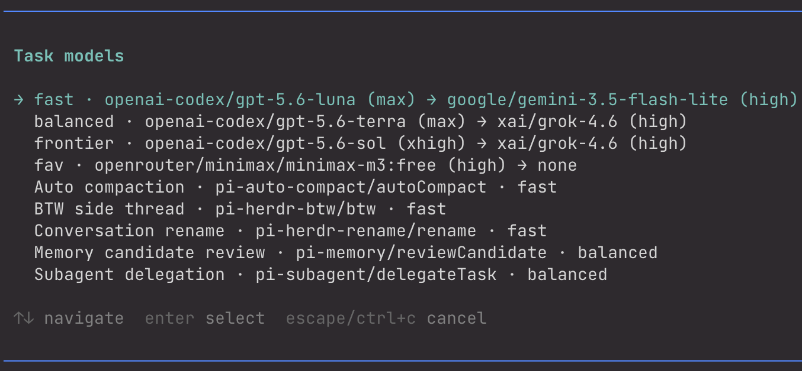
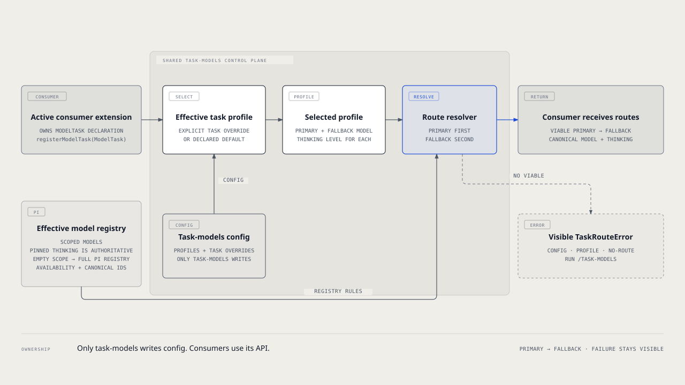

# `@henryqw/pi-task-models`

Choose shared model and thinking routes for extension tasks named `fast`, `balanced`, `frontier`, and `fav`.



## Why

- **Created for**: Pi users who want one place to route model work started by several extensions.
- **Advantage**: Reuse profile choices while each extension keeps ownership of its task and default.

## Install

```bash
pi install npm:@henryqw/pi-task-models
```

Run `/task-models` after installation. Configure each profile that your installed consumers require.

## With

| Package | Why |
| --- | --- |
| [`@henryqw/pi-auto-compact`](https://pi.henry.wang/extensions/pi-auto-compact) | Consumer. Its local compaction task defaults to `fast`. |
| [`@henryqw/pi-herdr-btw`](https://pi.henry.wang/extensions/pi-herdr-btw) | Consumer. Its local side-thread task defaults to `fast`. |
| [`@henryqw/pi-herdr-rename`](https://pi.henry.wang/extensions/pi-herdr-rename) | Consumer. Its local rename task defaults to `fast`. |
| [`@henryqw/pi-memory`](https://pi.henry.wang/extensions/pi-memory) | Consumer. Its local candidate-review task defaults to `balanced`. |
| [`@henryqw/pi-multi-codex`](https://pi.henry.wang/extensions/pi-multi-codex) | Improves. Numbered Codex slots dedupe to one route. |
| [`@henryqw/pi-prompt-creator`](https://pi.henry.wang/extensions/pi-prompt-creator) | Consumer. Its local prompt-drafting task defaults to `fast`. |
| [`@henryqw/pi-subagent`](https://pi.henry.wang/extensions/pi-subagent) | Consumer. Its local delegation task defaults to `fast`; callers can declare their own task. |

## Use

Run `/task-models` to complete the first setup:

1. Select `fast`.
2. Choose a primary model from Pi's effective registry, then choose its thinking level.
3. Choose a different fallback model and thinking level, or choose `None`.
4. Reopen `/task-models`. The `fast` row now shows the saved route instead of `not configured`.

Repeat these steps for `balanced`, `frontier`, or `fav` when a consumer needs them. The `fav` profile has no fallback.

Select an active task to override its declared profile. Choosing that task's declared default removes the override.

### Active declarations

Consumers register declarations at extension load. When `/task-models` opens, the shared control plane asks active extensions for declarations. Extension load order does not matter.

The control plane lists each active task's effective profile. Hidden explicit assignments stay stored when a consumer is disabled.



### Scoped models, aliases, and fallback

Menus and resolution use the current session's `ctx.scopedModels`, including pinned thinking. An empty scope uses Pi's full available model registry. Numbered Codex account aliases are deduplicated.

Fallback choices exclude the selected primary. BTW selects the first authenticated viable route before pane launch.

## Config

The shared JSON file is at `~/.pi/agent/config/pi-task-models/config.json`. Consumers use `loadTaskModelsConfig()` for validated values. They never read or write this file. Only explicit `/task-models` actions save it.

The following JSON shows structure only. Every model ID is a placeholder and must not be copied.

```json
{
  "profiles": {
    "fast": {
      "primary": { "model": "<provider>/<fast-model-from-Pi>", "thinkingLevel": "low" },
      "fallback": { "model": "<provider>/<fallback-model-from-Pi>", "thinkingLevel": "low" }
    },
    "balanced": {
      "primary": { "model": "<provider>/<balanced-model-from-Pi>", "thinkingLevel": "high" }
    },
    "frontier": {
      "primary": { "model": "<provider>/<frontier-model-from-Pi>", "thinkingLevel": "max" }
    },
    "fav": {
      "primary": { "model": "<provider>/<favorite-model-from-Pi>", "thinkingLevel": "high" }
    }
  },
  "tasks": {
    "pi-herdr-btw/btw": "balanced"
  }
}
```

Use exact model IDs offered by `/task-models`. Pi's registry, not this example, defines available models.

| Field | Required | Possible values | Default |
| --- | --- | --- | --- |
| `profiles` | No | Object keyed by `fast`, `balanced`, `frontier`, `fav`; unknown profile names are rejected | `{}` (no profiles configured) |
| `profiles.<profile>.primary.model` | Yes within a configured profile's `primary` | Canonical `provider/model` reference without whitespace or NUL; available models come from Pi's model registry (or session-scoped models) at resolution time, not from this file | — |
| `profiles.<profile>.primary.thinkingLevel` | Yes within a configured profile's `primary` | `off`, `minimal`, `low`, `medium`, `high`, `xhigh`, `max`; the model must support the level when the route resolves | — |
| `profiles.<profile>.fallback` | No | When present, requires both `model` and `thinkingLevel` with the corresponding `primary.*` values; not allowed for `fav` | Omitted |
| `tasks` | No | Object mapping task IDs (`<package>/<task>`) to explicit user profile overrides | `{}` |
| `tasks.<taskId>` | Value required if the key is present | `fast`, `balanced`, `frontier`, `fav` | That task declaration's `defaultProfile` |

Pi's model registry, including session-scoped models, is the source of available models at resolution. This file does not contain a model catalog.

Task defaults live only in consumer declarations. Existing explicit assignments, including one equal to a declaration's default, remain valid.

Model references use canonical `provider/model`. Numbered Codex account aliases (`openai-codex-N`) resolve through Pi's registry and store canonically as `openai-codex/<model>`.

Reads are strict. `loadTaskModelsConfig()` returns `{ source: "missing", value: { "profiles": {}, "tasks": {} } }` for a missing file. It does not create a file.

At session start, task-models warns when `~/.pi/agent/config/pi-task-models/config.json` is missing; run `/task-models` to configure task routes.

Malformed JSON, unknown keys, invalid task IDs, unknown profiles, or invalid profile or route values fail visibly with `/task-models` guidance. The malformed file is preserved.

## For extension authors

A `ModelTask` is a consumer-owned independently executed model operation. Consumers define a `ModelTask` and call `registerModelTask(pi, task)` at extension load.

Use `loadTaskModelsConfig()` to get validated config without reading a file. Its `source` is `"file"` or `"missing"`, so consumers can warn when defaults are in use.

Use `resolveConfiguredTaskRoute(ctx, task)` or `resolveConfiguredTaskRoutes(ctx, task)` to resolve routes. Profile thinking is authoritative for task routes. Resolution uses `config.tasks[task.id] ?? task.defaultProfile`.

Resolution errors are `TaskRouteError` values. Check `taskRouteCode`:

| Code | Meaning |
| --- | --- |
| `config-missing` | The optional shared config file is absent. |
| `config-read` | A present shared config file cannot be read or validated. |
| `profile-missing` | The selected profile is not configured. |
| `no-route` | The selected profile has no available route. |

Every error directs users to `/task-models`. A consumer may silence only `config-missing` when it has a safe current-session fallback.
