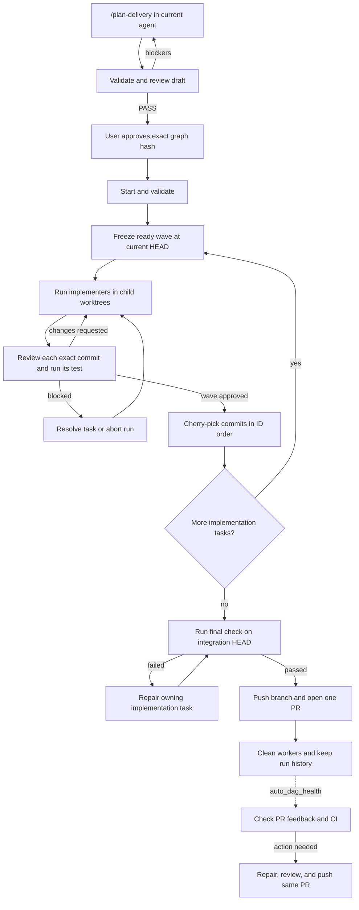

# `@henryqw/pi-auto-dag`

Pi extension for planning and running a Delivery Graph with Pi and Herdr.

`/plan-delivery` turns current conversation and repository context into an independently reviewed, user-approved graph. Auto DAG then runs dependent tasks in parallel, reviews every commit, integrates approved work, runs a final check, and opens one PR.

## Key terms

| Term | Meaning |
| --- | --- |
| Delivery Graph | Approved JSON plan for one delivery |
| Local Issue | One task in that plan |
| Wave | Tasks that are ready at the same time and share one Git base |
| Run State | Saved progress for one run |

## Setup

Auto DAG has two extension entry points:

| Pi profile | Extension | Purpose |
| --- | --- | --- |
| Main integration profile | `extensions/auto-dag.ts` | Owns the run, UI, Git integration, and PR |
| `coder`, `backend`, `frontend` | `extensions/worker.ts` | Implements Delivery Graph tasks |
| `reviewer` | `extensions/worker.ts` | Reviews plans, commits, final checks, and PR health |

Do not load `auto-dag.ts` in worker profiles or `worker.ts` in the main profile.

### Main integration profile

Load only the orchestrator extension from this package:

```json
{
  "packages": [{
    "source": "npm:@henryqw/pi-auto-dag",
    "autoload": false,
    "extensions": ["extensions/auto-dag.ts"]
  }]
}
```

### Worker profiles

All four worker profiles—`coder`, `backend`, `frontend`, and `reviewer`—must load `extensions/worker.ts`.

Add this package setting to `settings.json` in every worker profile directory:

```json
{
  "packages": [{
    "source": "npm:@henryqw/pi-auto-dag",
    "autoload": false,
    "extensions": ["extensions/worker.ts"]
  }]
}
```

When a worker starts, Auto DAG sets `PI_CODING_AGENT_DIR` to the selected profile directory. Pi loads that directory's settings and registers role-specific tools from `worker.ts`:

- Implementers get tools to request review or report a blocker.
- Planning reviewers get only read tools plus `auto_dag_submit_plan_review`, which records `PASS` for exact current graph hash.
- Run reviewers get only phase-valid tools: ordinary and final-gate reviewers submit reviews or blockers; PR-health reviewers can also report health.

Without `worker.ts`, workers cannot send results back to the main run.

Delivery Graph tasks select `coder`, `backend`, or `frontend`. Auto DAG selects `reviewer` when review starts.

Worker launches also:

- Disable default skills with `--no-skills`.
- Load skills from the selected worker profile.
- Load shared skills from the main worktree.
- Limit built-in tools by worker role.

## Configuration

Create `~/.pi/agent/config/pi-auto-dag.json`:

```json
{
  "version": 1,
  "profiles": {
    "coder": "/absolute/path/to/coder",
    "backend": "/absolute/path/to/backend",
    "frontend": "/absolute/path/to/frontend",
    "reviewer": "/absolute/path/to/reviewer"
  }
}
```

`PI_CODING_AGENT_DIR` changes the Pi agent directory.

Optional settings:

| Setting | Default | Meaning |
| --- | ---: | --- |
| `max_parallel_tasks` | `5` | Most implementation tasks running at once |
| `max_review_rounds` | `5` | Most review rounds per task |

Both values must be positive integers.

## Delivery Graph

Put the graph at `.context/issues/graph.json` in the main worktree. This path cannot be changed.

Graph rules:

- File must be ignored and untracked; planning, validation, approval, and intake enforce this boundary.
- `status` is `"draft"` while planning and must be `"approved"` before execution.
- Top-level fields are exactly `status`, `id`, `goal`, `constraints`, `non_goals`, `issues`, and `final_check`.
- Implementation issue fields are exactly `id`, `title`, `profile`, `objective`, `acceptance`, `testing`, and `depends_on`.
- `final_check` has only `acceptance` and `testing`; Auto DAG derives its execution task after all implementation issues.
- IDs use lowercase hyphenated names; `final-check` is reserved.
- Profiles are `coder`, `backend`, or `frontend`.
- Dependencies must reference implementation IDs and form an acyclic graph.
- Required strings and acceptance arrays cannot be empty.

Minimal example:

```json
{
  "status": "approved",
  "id": "example-delivery",
  "goal": "Deliver one checked change.",
  "constraints": [],
  "non_goals": [],
  "issues": [
    {
      "id": "implement-change",
      "title": "Implement change",
      "profile": "backend",
      "objective": "Make requested behavior observable end to end.",
      "acceptance": ["Caller observes requested behavior."],
      "testing": "npm test",
      "depends_on": []
    }
  ],
  "final_check": {
    "acceptance": ["Integrated verification passes."],
    "testing": "npm test"
  }
}
```

## Workflow



### 1. Plan and approve

Run `/plan-delivery` in an interactive Pi TUI inside Herdr. Invocation may start from any repository subdirectory; Pi resolves the Git top-level and uses it for every planning path and active-run check. Current main agent remains planner. It uses conversation context, inspects repository facts, asks only unresolved product decisions, and writes draft graph.

Workflow validates structure with `auto_dag_validate`, then starts configured read-only reviewer in pane split inside current Herdr tab. Reviewer checks acceptance traceability, vertical slicing, dependencies, interference, and test quality. Reviewer records `PASS` directly through `auto_dag_submit_plan_review`, producing temporary evidence bound to approved-form graph SHA-256. Planner then shows full summary and calls `auto_dag_approve`. Approval rejects missing or stale evidence, rechecks it after native confirmation, removes it, and atomically writes approved graph.

Planning never calls `auto_dag_start`. Existing draft can resume or be replaced. Existing approved idle graph can only be replaced or left unchanged. Active run blocks planning and approval.

### 2. Start

Run `auto_dag_start` from main Herdr pane. Lifecycle tools resolve the same Git top-level when Pi started in a repository subdirectory.

Auto DAG checks:

- Graph and profile configuration.
- Main branch and current `HEAD`.
- Clean integration worktree.
- Herdr workspace and main pane.
- No other active run in this checkout.

It then saves Run State and locks the checkout.

### 3. Implement and review

Auto DAG groups ready tasks into a wave. Every task in that wave starts from the same commit.

For each task:

1. Create a child worktree at `.<repo>-auto-dag/<run-id>/<issue-id>`.
2. Start one implementer.
3. Require one commit over the wave base.
4. Start a task-owned reviewer.
5. Run the task's exact `testing` command.

Approval requires exit code `0`. Requested changes return to the same implementer for a new commit SHA.

### 4. Integrate

Auto DAG waits for every task in the wave to pass review.

It then:

- Cherry-picks commits by Local Issue ID.
- Updates the saved integration `HEAD`.
- Cleans integrated task resources.
- Starts the next ready wave.

A cherry-pick conflict returns that task to its existing workers. They produce one replacement commit from the new integration base.

### 5. Final check and PR

After all implementation tasks finish, a temporary read-only reviewer runs `final_check.testing` on the integration `HEAD`.

- Pass: push the integration branch and open one PR.
- Fail: block before push or PR creation.

To repair a failed final check, call `auto_dag_resolve` with the completed implementation task that owns the bug. Auto DAG creates a fresh repair worktree, reviews its commit, cherry-picks it, and reruns the final check.

## Lifecycle tools

| Tool or command | Use |
| --- | --- |
| `/plan-delivery` | Draft, review, and approve graph without execution |
| `auto_dag_validate` | Validate exact graph contract and derive waves |
| `auto_dag_submit_plan_review` | Reviewer-only: record `PASS` for exact current candidate hash |
| `auto_dag_approve` | Require matching reviewer `PASS`, confirm exact candidate hash, and atomically approve draft |
| `auto_dag_start` | Start approved graph |
| `auto_dag_status` | Read active or retained run |
| `auto_dag_resume` | Recover workers, pending events, or cleanup |
| `auto_dag_resolve` | Unblock one task with user guidance |
| `auto_dag_abort` | Stop run and clean owned resources |
| `auto_dag_health` | Check feedback and CI on completed PR |

`resume`, `resolve`, and `abort` use the only active run. `health` requires a retained `run_id`; `status` accepts one when reading run history.

Run-worker messages go straight to lifecycle. Planning-review `PASS` goes straight to temporary `.context/issues/review.json`. Neither needs model turn in main pane. Initial run-worker prompts include graph `goal`, `constraints`, and `non_goals` alongside task context.

## Blocks, recovery, and aborts

When a task blocks:

- New worker dispatch pauses.
- In-flight reviewers may still report results.
- `auto_dag_resolve` resumes the blocked role with user guidance.

`auto_dag_resume` rechecks config and Git state. It also:

- Asks live workers to resend their last event.
- Restarts missing workers with saved instructions.
- Recovers completed cherry-picks.
- Retries cleanup.

`auto_dag_abort` closes owned tabs and removes safe worktrees. It never force-deletes uncommitted work or unintegrated branches.

## PR health

Call `auto_dag_health` for a completed run when its PR has new feedback.

Auto DAG:

1. Fast-forwards the local branch to the exact remote PR head.
2. Uses one read-only reviewer to inspect unresolved threads and failing checks.
3. Stops if nothing needs work.
4. Otherwise creates one repair worktree and starts one coder.
5. Uses the same reviewer to approve the repair.
6. Pushes once to the same PR and resolves only fixed, triaged threads.

It never resets or switches branches. A changed remote PR head blocks an active repair.

Run health again for later feedback.

## State and UI

Run files live under `.context/pi-auto-dag/`:

```text
.context/pi-auto-dag/
├── active.json
└── runs/<run-id>/state.json
```

`active.json` locks one checkout. Lock stays until cleanup succeeds.

Run State records graph hash, source commit, expected integration `HEAD`, main pane, tasks, PR, and health evidence. Writes are atomic.

Main Pi widget shows:

- Active and blocked workers.
- Current task and activity.
- Live Herdr state.
- Time in current activity.
- Block reason.

Run history remains after completion until removed manually.

## Development

```bash
npm run dev:ui --workspace @henryqw/pi-auto-dag
npm test --workspace @henryqw/pi-auto-dag -- core
npm test --workspace @henryqw/pi-auto-dag -- orchestration
npm test --workspace @henryqw/pi-auto-dag -- planning
npm test --workspace @henryqw/pi-auto-dag -- pr-lifecycle
npm run typecheck --workspace @henryqw/pi-auto-dag
npm run pack:check --workspace @henryqw/pi-auto-dag
```

`dev:ui` opens an offline Pi TUI with fixed worker states for widget testing.
