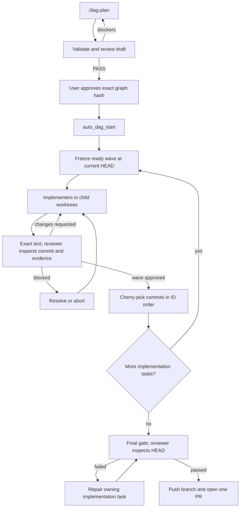

# `@henryqw/pi-auto-dag`

Plan and run a local Delivery Graph with Pi and Herdr: review, approve, execute dependent tasks, then open one PR.

## Why

- **Created for**: Planning and executing a local Delivery Graph of dependent tasks through review and approval gates.
- **Advantage**: Validates one immutable plan before dependency-aware workers run in parallel and integrate into one PR.
- **Inspired by**: DAG schedulers, isolated Git worktrees, and explicit approval gates.

## Install

```bash
pi install npm:@henryqw/pi-task-models
pi install npm:@henryqw/pi-auto-dag
```

Needs a POSIX host. Windows fails before gate execution. `pi-task-models` provides shared `/task-models` configuration.

Load the orchestrator only in the main integration session.

```json
{
  "packages": [{
    "source": "npm:@henryqw/pi-auto-dag",
    "autoload": false,
    "extensions": ["extensions/auto-dag.ts"]
  }]
}
```

Worker policy comes from user-owned `@henryqw/pi-subagent` Roles. Subagent resolves Role Skills, tools, extensions, shared task-model route, Pi arguments, and managed Herdr lifecycle. Auto DAG adds `extensions/worker.ts` with graph protocol tools and owns graph state, prompts, gates, receipts, and execution decisions.

## Use

| Surface | Type | Purpose |
| --- | --- | --- |
| `/dag-plan` | command | Draft, review, and approve a graph. No execution. Needs interactive TUI inside Herdr. |
| `/dag-widget` | command | `show`, `hide`, or `fix` the worker widget. `fix` dismisses entries whose worker is confirmed missing. |
| `auto_dag_validate` | tool | Validate the graph contract and derive waves. |
| `auto_dag_approve` | tool | Confirm the exact hash and atomically approve the draft. Never starts a run. |
| `auto_dag_start` | tool | Start the approved graph. |
| `auto_dag_status` | tool | Read the active run, or one retained run by ID. |
| `auto_dag_resume` | tool | Recover workers, pending events, or cleanup. |
| `auto_dag_retry_gate` | tool | Archive infrastructure-invalid Final Check evidence and retry the exact gate. TUI confirm. |
| `auto_dag_resolve` | tool | Unblock one task; optional exact replacement for a failed Required Gate command. |
| `auto_dag_abort` | tool | Stop the run and clean owned resources. Never force-deletes uncommitted work. |
| `auto_dag_health` | tool | Check PR feedback and CI for a retained `run_id`. |
| `auto_dag_submit_plan_review` | tool | Worker: record `PASS` for the exact current graph hash. |
| `auto_dag_request_review` | tool | Worker implementer: request review. |
| `auto_dag_submit_review` | tool | Worker reviewer: submit verdict and findings. |
| `auto_dag_submit_health` | tool | Worker reviewer: submit PR-health summary. |
| `auto_dag_block_task` | tool | Worker: block the current task. |

`auto_dag_resume`, `auto_dag_retry_gate`, `auto_dag_resolve`, and `auto_dag_abort` use the only active run.

## Config

`~/.pi/agent/config/pi-auto-dag.json`

```json
{
  "version": 4,
  "implementation_roles": ["coder", "backend", "frontend"],
  "reviewer_role": "reviewer",
  "repair_role": "coder"
}
```

Role definitions live in `~/.pi/agent/config/pi-subagent/*.md`. Every referenced Role must exist; `repair_role` must be one of `implementation_roles`. Auto DAG uses shared tasks `pi-auto-dag/implement` (default `balanced`) and `pi-auto-dag/review` (default `frontier`). Invalid Role or model routes block before worker creation.

| Setting | Default | Meaning |
| --- | ---: | --- |
| `max_parallel_tasks` | `5` | Most implementation tasks at once |
| `max_review_rounds` | `5` | Most review rounds per task |
| `required_gate_timeout_ms` | `1800000` | Max runtime per required gate; timeout exits `124` |

All optional values must be positive integers. `required_gate_timeout_ms` cannot exceed `2147483647`.

## Delivery Graph

Put the graph at `.context/issues/graph.json`. This path cannot change. File must stay ignored and untracked.

- `status` is `"draft"` while planning and must be `"approved"` before execution.
- Top-level fields are exactly `status`, `id`, `goal`, `constraints`, `non_goals`, `issues`, and `final_check`.
- Implementation issue fields are exactly `id`, `title`, `profile`, `objective`, `acceptance`, `testing`, and `depends_on`.
- `final_check` has only `acceptance` and `testing`.
- IDs are lowercase hyphenated names; `final-check` is reserved.
- Each `profile` value must name a configured `implementation_roles` Role. Dependencies must be acyclic.

```json
{
  "status": "approved",
  "id": "example-delivery",
  "goal": "Deliver one checked change.",
  "constraints": [],
  "non_goals": [],
  "issues": [
    {
      "id": "implement-change",
      "title": "Implement change",
      "profile": "coder",
      "objective": "Make requested behavior observable end to end.",
      "acceptance": ["Caller observes requested behavior."],
      "testing": "npm test",
      "depends_on": []
    }
  ],
  "final_check": {
    "acceptance": ["Integrated verification passes."],
    "testing": "npm ci && npm test && npm run typecheck"
  }
}
```

## Workflow



1. `/dag-plan` writes a draft, validates, starts a same-tab planning reviewer, then `auto_dag_approve` persists the exact hash. It never calls `auto_dag_start`.
2. `auto_dag_start` checks graph, config, clean worktree, Herdr, and that no other run is active, then locks the checkout.
3. Ready tasks share one Git base. Each gets a child worktree, one implementer, one required commit, and the exact `testing` command through `sh -c`. Reviewer sees the commit and gate evidence; approval needs system-owned exit code `0`.
4. After the wave passes, Auto DAG cherry-picks by Local Issue ID and starts the next wave. A cherry-pick conflict returns that task to its workers.
5. After every implementation task, Auto DAG runs Final Check on clean integration `HEAD`, then pushes one PR. Product failure repairs through the owning Local Issue. Invalid command text uses `auto_dag_resolve` with `replacement_command`. Infrastructure failure uses `auto_dag_retry_gate`.

## Recovery

- Blocked task: new dispatch pauses. `auto_dag_resolve` resumes that role with user guidance.
- `auto_dag_resume` rechecks config and Git, asks live workers to resend, restarts missing workers, and retries cleanup. Failed Required Gate evidence is never rerun automatically.
- `auto_dag_health` on a completed run fast-forwards to the remote PR head, triages threads and checks, then optionally repairs and pushes once to the same PR.

Run State schema is version `4`. Files live under `.context/pi-auto-dag/active.json` and `.context/pi-auto-dag/runs/<run-id>/state.json`. `active.json` locks one checkout until cleanup succeeds.

## Remove

```bash
pi remove npm:@henryqw/pi-auto-dag
```

## Development

```bash
npm run dev:ui --workspace @henryqw/pi-auto-dag
npm test --workspace @henryqw/pi-auto-dag -- orchestration
npm test --workspace @henryqw/pi-auto-dag -- planning
npm test --workspace @henryqw/pi-auto-dag -- pr-lifecycle
npm run typecheck --workspace @henryqw/pi-auto-dag
npm run pack:check --workspace @henryqw/pi-auto-dag
```

`dev:ui` opens an offline Pi TUI with fixed worker states for widget testing.
