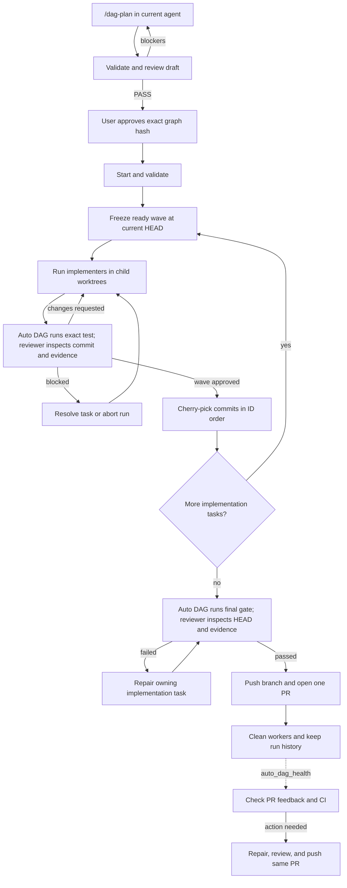

# `@henryqw/pi-auto-dag`

Pi extension for planning and running a Delivery Graph with Pi and Herdr.

`/dag-plan` turns current conversation and repository context into an independently reviewed, user-approved graph. Auto DAG then runs dependent tasks in parallel, executes each frozen test gate, gives commit-bound evidence to reviewers, integrates approved work, runs a final check, and opens one PR.

## Key terms

| Term | Meaning |
| --- | --- |
| Delivery Graph | Approved JSON plan for one delivery |
| Local Issue | One task in that plan |
| Wave | Tasks that are ready at the same time and share one Git base |
| Run State | Saved progress for one run |

## Setup

Load orchestrator extension only in main integration profile:

```json
{
  "packages": [{
    "source": "npm:@henryqw/pi-auto-dag",
    "autoload": false,
    "extensions": ["extensions/auto-dag.ts"]
  }]
}
```

Worker profiles remain reusable Pi profiles and must not load Auto DAG. Auto DAG injects `extensions/worker.ts` when it launches a worker, adding only role-specific lifecycle tools:

- Implementers request review or report blockers.
- Planning reviewers record `PASS` for exact current graph hash.
- Run reviewers inspect code and system-owned gate evidence, then submit verdicts, findings, health, or blocker events allowed by current phase.

Herdr only hosts processes. Auto DAG passes resolved environment and Pi arguments when creating each process.

## Profile resolver

Profile definitions live outside Auto DAG. Configure one command which accepts profile ID as final argument and writes one JSON object to stdout:

```json
{
  "version": 1,
  "id": "backend",
  "description": "Backend implementation",
  "agent_dir": "/absolute/path/to/profiles/backend",
  "skills": [
    "/absolute/path/to/profiles/backend/.agents/skills",
    "/absolute/path/to/shared-skills/.agents/skills"
  ],
  "tools": ["read", "bash", "edit", "write", "grep", "find", "ls"]
}
```

`id` must match requested ID. `agent_dir` and every skill path must be absolute existing directories. Profile directory settings own model, system prompt, packages, and other Pi behavior. Resolver owns baseline skills and tools. Auto DAG adds worker extension and lifecycle tools.

Packaged [`examples/pi-profile.sh`](examples/pi-profile.sh) provides reusable launch and resolver modes. Copy it into Pi config, then customize profile IDs and tool lists:

```bash
mkdir -p ~/.pi/scripts
cp node_modules/@henryqw/pi-auto-dag/examples/pi-profile.sh ~/.pi/scripts/pi-profile.sh
chmod +x ~/.pi/scripts/pi-profile.sh
~/.pi/scripts/pi-profile.sh resolve backend
```

## Configuration

Create `~/.pi/agent/config/pi-auto-dag.json`:

```json
{
  "version": 2,
  "profile_resolver": ["~/.pi/scripts/pi-profile.sh", "resolve"],
  "implementation_profiles": ["coder", "backend", "frontend"],
  "reviewer_profile": "reviewer",
  "repair_profile": "coder"
}
```

Auto DAG appends each configured profile ID to `profile_resolver`, resolves all profiles before use, and rejects malformed output or missing resources. `repair_profile` must be one of `implementation_profiles`.

Optional settings:

| Setting | Default | Meaning |
| --- | ---: | --- |
| `max_parallel_tasks` | `5` | Most implementation tasks running at once |
| `max_review_rounds` | `5` | Most review rounds per task |
| `required_gate_timeout_ms` | `1800000` | Maximum runtime for each required gate; timeout exits with code `124` |

All values must be positive integers. `required_gate_timeout_ms` cannot exceed Node's timer maximum, `2147483647`.

## Delivery Graph

Put the graph at `.context/issues/graph.json` in the main worktree. This path cannot be changed.

Graph rules:

- File must be ignored and untracked; planning, validation, approval, and intake enforce this boundary.
- `status` is `"draft"` while planning and must be `"approved"` before execution.
- Top-level fields are exactly `status`, `id`, `goal`, `constraints`, `non_goals`, `issues`, and `final_check`.
- Implementation issue fields are exactly `id`, `title`, `profile`, `objective`, `acceptance`, `testing`, and `depends_on`.
- `final_check` has only `acceptance` and `testing`; Auto DAG derives its execution task after all implementation issues.
- IDs use lowercase hyphenated names; `final-check` is reserved.
- Profiles must be IDs listed in configured `implementation_profiles`.
- Dependencies must reference implementation IDs and form an acyclic graph.
- Required strings and acceptance arrays cannot be empty.

Minimal example:

```json
{
  "status": "approved",
  "id": "example-delivery",
  "goal": "Deliver one checked change.",
  "constraints": [],
  "non_goals": [],
  "issues": [
    {
      "id": "implement-change",
      "title": "Implement change",
      "profile": "backend",
      "objective": "Make requested behavior observable end to end.",
      "acceptance": ["Caller observes requested behavior."],
      "testing": "npm test",
      "depends_on": []
    }
  ],
  "final_check": {
    "acceptance": ["Integrated verification passes."],
    "testing": "npm test"
  }
}
```

## Workflow



### 1. Plan and approve

Run `/dag-plan` in an interactive Pi TUI inside Herdr. Invocation may start from any repository subdirectory; Pi resolves the Git top-level and uses it for every planning path and active-run check. Current main agent remains planner. It uses conversation context, inspects repository facts, asks only unresolved product decisions, and writes draft graph.

Workflow validates structure with `auto_dag_validate`, then starts configured read-only reviewer in pane split inside current Herdr tab. Reviewer checks acceptance traceability, vertical slicing, dependencies, interference, and test quality. Reviewer records `PASS` directly through `auto_dag_submit_plan_review`, producing temporary evidence bound to approved-form graph SHA-256. Planner then shows full summary and calls `auto_dag_approve`. Approval rejects missing or stale evidence, rechecks it after native confirmation, removes it, and atomically writes approved graph.

After approval, planning verifies current branch can host an Auto DAG run, then checks for changes and offers to stage and commit them with a user-provided message. It then identifies `auto_dag_start` as next step but never calls it. Existing draft can resume or be replaced. Existing approved idle graph can only be replaced or left unchanged. Active run blocks planning and approval.

### 2. Start

Run `auto_dag_start` from main Herdr pane. Lifecycle tools resolve the same Git top-level when Pi started in a repository subdirectory.

Auto DAG checks:

- Graph and profile configuration.
- Main branch and current `HEAD`.
- Clean integration worktree.
- Herdr workspace and main pane.
- No other active run in this checkout.

It then saves Run State and locks the checkout.

### 3. Implement and review

Auto DAG groups ready tasks into a wave. Every task in that wave starts from the same commit.

For each task:

1. Create a child worktree at `.<repo>-auto-dag/<run-id>/<issue-id>`.
2. Start one implementer.
3. Require one commit over the wave base.
4. Verify that commit and clean worktree, then execute frozen `testing` text unchanged through `sh -c` with configured deadline and process-group cleanup. Active process identity is persisted so resume or abort signals only the recorded gate; normal completion also reaps background descendants.
5. Save command, verified commit SHA, exit code, and bounded stdout/stderr evidence, then restore commit and remove gate-created tracked, untracked, and ignored dirt while preserving ignored resources that predated the gate. Output overflow becomes failed evidence, with exact captured streams retained in SHA-256-bound files instead of Run State.
6. Start task-owned reviewer with one canonical Review Packet. Gate output uses same bounded evidence and read-on-demand full-output references.

Auto DAG owns deterministic Git and gate verification. Reviewer inspects diff and acceptance criteria instead of repeating clean-worktree, base, or commit-count checks. Reviewer submits only verdict and findings; worker extension captures scope-specific system-owned dispatch identity when each reviewer turn starts, so stale or duplicated verdicts cannot approve another commit or review round. Extra diagnostics or broader tests cannot replace required frozen gate, and approval requires system-owned exit code `0`. Requested changes return to same implementer for new commit SHA, which gets fresh gate evidence. Auto DAG never normalizes shell text or asks reviewer to echo it for comparison.

### 4. Integrate

Auto DAG waits for every task in the wave to pass review.

It then:

- Cherry-picks commits by Local Issue ID.
- Updates the saved integration `HEAD`.
- Cleans integrated task resources.
- Starts the next ready wave.

A cherry-pick conflict returns that task to its existing workers. They produce one replacement commit from the new integration base.

### 5. Final check and PR

After all implementation tasks finish, Auto DAG executes exact frozen `final_check.testing` text on clean integration `HEAD`, captures commit-bound evidence, then starts temporary read-only reviewer.

- Pass: copy checkout-local ignored tools into a disposable child worktree at integration `HEAD`, execute final gate without sharing mutable files, require reviewer approval and system-owned gate exit code `0`, then push integration branch and open one PR.
- Fail: block before push or PR creation.

To repair failed final check, call `auto_dag_resolve` with completed implementation task that owns bug. Auto DAG creates fresh repair worktree, executes same frozen gate against repair commit before review, cherry-picks approved repair, then executes final gate again on new integration `HEAD`. Broken frozen command needs user resolution or replacement Delivery Graph; reviewer cannot substitute another command.

## Lifecycle tools

| Tool or command | Use |
| --- | --- |
| `/dag-plan` | Draft, review, and approve graph without execution |
| `/dag-widget show\|hide\|fix` | Show or hide worker widget; dismiss entries whose worker is confirmed missing |
| `auto_dag_validate` | Validate exact graph contract and derive waves |
| `auto_dag_submit_plan_review` | Reviewer-only: record `PASS` for exact current candidate hash |
| `auto_dag_approve` | Require matching reviewer `PASS`, confirm exact candidate hash, and atomically approve draft |
| `auto_dag_start` | Start approved graph |
| `auto_dag_status` | Read active or retained run |
| `auto_dag_resume` | Recover workers, pending events, or cleanup |
| `auto_dag_resolve` | Unblock one task with user guidance |
| `auto_dag_abort` | Stop run and clean owned resources |
| `auto_dag_health` | Check feedback and CI on completed PR |

`resume`, `resolve`, and `abort` use the only active run. `health` requires a retained `run_id`; `status` accepts one when reading run history.

Run-worker messages go straight to lifecycle. Planning-review `PASS` goes straight to temporary `.context/issues/review.json`. Neither needs model turn in main pane. Fresh review agents receive one canonical packet containing delivery context, issue, worktree, base, and gate evidence. Existing reviewers receive only changed gate/findings/resolution data; a no-change resume sends only `{"type":"auto_dag_resend"}`.

## Blocks, recovery, and aborts

When a task blocks:

- New worker dispatch pauses.
- In-flight reviewers may still report results.
- `auto_dag_resolve` resumes the blocked role with user guidance.

`auto_dag_resume` rechecks config and Git state. It also:

- Asks live workers to resend their last event.
- Restarts missing workers with saved instructions.
- Recovers completed cherry-picks.
- Retries cleanup.

`auto_dag_abort` closes owned tabs and removes safe worktrees. It never force-deletes uncommitted work or unintegrated branches.

## PR health

Call `auto_dag_health` for a completed run when its PR has new feedback.

Auto DAG:

1. Fast-forwards the local branch to the exact remote PR head.
2. Uses one read-only reviewer to inspect unresolved threads and failing checks.
3. Stops if nothing needs work.
4. Otherwise creates one repair worktree and starts configured repair profile.
5. Executes frozen final-check gate against exact repair commit and gives evidence to same reviewer.
6. Pushes once to the same PR and resolves only fixed, triaged threads.

For approved PR-health repair, reviewer `findings` contain only fixed triaged thread IDs. It never resets or switches branches. Changed remote PR head blocks active repair.

Run health again for later feedback.

## State and UI

Run files live under `.context/pi-auto-dag/`:

```text
.context/pi-auto-dag/
├── active.json
└── runs/<run-id>/state.json
```

`active.json` locks one checkout. Lock stays until cleanup succeeds.

Run State schema version is `2`. v4 rejects v3 in-flight Run State; finish or abort active v3 runs before upgrading. Run State records graph hash, source commit, expected integration `HEAD`, main pane, tasks, PR, health evidence, and bounded required-gate evidence. Large gate streams and active gate-process intent live in separate run files. Writes are atomic.

Main Pi widget shows:

- Active and blocked workers.
- Current task and activity.
- Live Herdr state.
- Time in current activity.
- Block reason.

Widget entries derive from Run State and live Herdr status; widget never changes orchestration state. `/dag-widget fix` dismisses only non-blocked entries whose expected worker is absent. Dismissal lasts for current worker incarnation and clears when worker appears or lifecycle advances.

Run history remains after completion until removed manually.

## Development

```bash
npm run dev:ui --workspace @henryqw/pi-auto-dag
npm test --workspace @henryqw/pi-auto-dag -- core
npm test --workspace @henryqw/pi-auto-dag -- orchestration
npm test --workspace @henryqw/pi-auto-dag -- planning
npm test --workspace @henryqw/pi-auto-dag -- pr-lifecycle
npm run typecheck --workspace @henryqw/pi-auto-dag
npm run pack:check --workspace @henryqw/pi-auto-dag
```

`dev:ui` opens an offline Pi TUI with fixed worker states for widget testing.
