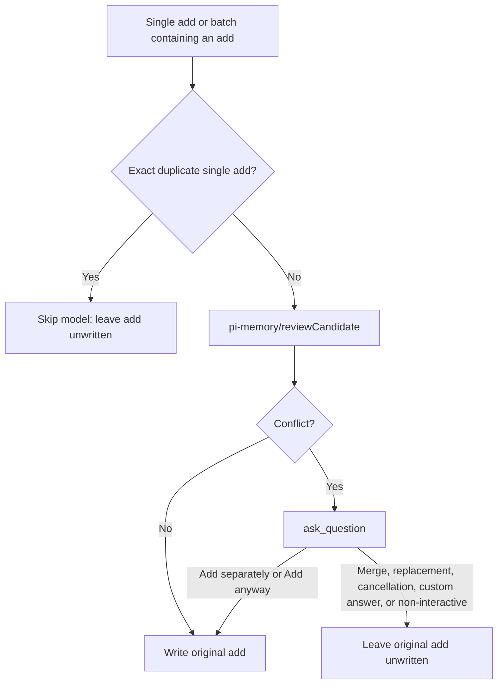

# `@henryqw/pi-memory`

Keep two auto-managed Markdown memory stores for Pi. Each session uses a frozen system-prompt snapshot.

## Why

- **Created for**: Give Pi compact global notes and user facts that survive across sessions.
- **Advantage**: Size-capped, auto-managed Markdown stores give predictable prompt cost without a hand-maintained knowledge tree.
- **Inspired by**: [Hermes Agent](https://github.com/NousResearch/hermes-agent) and its bounded `MEMORY.md`/`USER.md` cross-session memory pattern.

## Install

```bash
pi install npm:@henryqw/pi-memory
```

## With

| Package | Why |
| --- | --- |
| `@henryqw/pi-ask-question` | Required. Provides the validated conflict prompt. |
| `@henryqw/pi-herdr-btw` | Improves. Marks side-thread children so parent-only memory injection and dream advice are suppressed. |
| `@henryqw/pi-task-models` | Required. Provides candidate-review routes. |

## Use

| Surface | Type | Purpose |
| --- | --- | --- |
| `/remember <instruction>` | command | Process an instruction into compact durable memory; semantic conflicts require user resolution; busy requests queue in FIFO order. |
| `/dream` | command | Promote invariant memory instructions into the agent-global `~/.pi/agent/SYSTEM.md`. |
| `memory` | tool | Add, replace, remove, or batch-edit entries across sessions. |

### Stores and snapshots

| Store | Scope | Default cap |
| --- | --- | --- |
| `MEMORY.md` | Global agent notes shared across all projects. Do not store project-specific facts here; they belong in the repository. | 8800 characters |
| `USER.md` | User profile. | 5500 characters |

Each file holds entries delimited by `§` and is size-capped. When a write would exceed its cap, the tool rejects it and reports current usage.

Consolidate with one batch that removes or shortens stale entries and adds the new entry together. A batch checks only the final size.

An external edit or sync can push an on-disk file over its cap. The session snapshot then omits the overflow and warns instead of injecting it.

At session start, both stores are captured. Later edits do not alter injected memory.

Read `<directory>/MEMORY.md` and `<directory>/USER.md` to inspect live state.

### Candidate review

Every single `add` and every batch containing an `add` is independently reviewed by the local `pi-memory/reviewCandidate` Model Task. It defaults to the shared `balanced` profile.



The tool snapshots live agent-global `SYSTEM.md`, `MEMORY.md`, and `USER.md`. A missing `SYSTEM.md` is empty. Unreadable, oversized, or over-cap sources fail closed.

It resolves the configured Pi registry primary route, then fallback, through `/task-models`. It never substitutes the current session model. It accepts only verified bounded JSON evidence.

An overlap or contradiction pauses through `ask_question`. MEMORY/USER conflicts recommend merge or replacement. SYSTEM conflicts recommend keeping SYSTEM because pi-memory never edits it.

Exact duplicate single adds remain idempotent without a model call. Merge, replacement, cancellation, custom answers, and non-interactive UI leave the add unwritten. Only explicit `Add separately` or `Add anyway` writes the original add after a conflict.

### `/remember`

`/remember <instruction>` shows `Remembering…` while its processing instruction stays hidden. It normalizes a candidate, then uses the same tool review.

If Pi is busy, it queues the trimmed instruction. It processes one queued instruction after each settled response with freshly read live entries. Unsuitable project-specific, temporary, trivial, or otherwise unsuitable content is refused.

### `/dream`

Pi recommends `/dream` when memory is non-empty and no previous dream is recorded. It also recommends it when memory is non-empty and the last dream was over 30 days ago.

It recommends `/dream` when either store is at least 70% full and the last dream was at least 7 days ago.

`/dream` records its completed run time in `~/.pi/agent/config/pi-memory/dream.json`. It validates live state first and reuses unchanged memory snapshots. It always requires the model to read and edit only the agent-global `~/.pi/agent/SYSTEM.md`, never a project `.pi/SYSTEM.md`.

That global file must already exist and be readable. Establish it deliberately and completely, because a partial SYSTEM replaces Pi's default prompt.

### Per-turn memory check

`/dream` and final memory qualification remain current-session-agent workflows, not Model Tasks.

Each turn's memory check asks the current agent to save qualifying durable user identity, preferences, style, or corrections immediately to `target=user`. It saves stable cross-project environment facts, conventions, workflow lessons, or tool quirks useful later to `target=memory`.

Use the memory tool immediately only when something qualifies. Save inferred habits only after two independent signals from the conversation and/or existing profile. Skip project- or repository-specific facts, task-local behavior, progress, and temporary preferences.

## Config

Optional JSON file at the exact package-owned path `~/.pi/agent/config/pi-memory/config.json`. All fields are optional. A missing file uses defaults.

| Field | Required | Possible values | Default |
| --- | --- | --- | --- |
| `directory` | No | Non-empty absolute path without control characters, e.g. an iCloud- or Obsidian-synced folder | `~/.pi/agent/config/pi-memory/memory` |
| `memoryCharLimit` | No | Safe integer 1–100000 | `8800` |
| `userCharLimit` | No | Safe integer 1–100000 | `5500` |

Any other invalid configuration fails fast. Malformed JSON, invalid UTF-8, files over 64 KiB, non-object roots, unknown keys, or out-of-range values throw an error naming the problem. The file is never rewritten.

## Storage & sync

Point `directory` at an iCloud Drive or Obsidian-vault-synced folder. The synced vault only carries files. pi-memory owns the file format and treats the remote as opaque storage, so no merge logic runs on the Pi side.

Backups and the lock file live outside `directory`, under `~/.pi/agent/config/pi-memory/backups/`.

## Threat model

Because the directory can be a globally synced location readable outside Pi, review [`ADR 006 — pi-memory global store threat model`](https://github.com/HenryQW/pi-packages/blob/main/docs/adr/006-pi-memory-global-store-threat-model.md) before pointing it at a shared or cloud-synced path.
